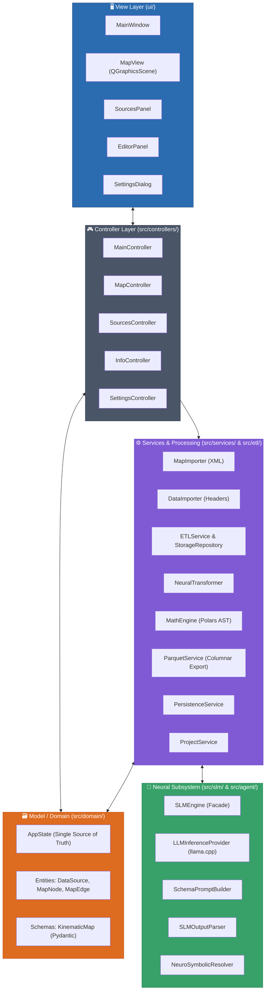

# ⚙️ Technical Architecture & Design Principles

This document provides a comprehensive technical breakdown of the architecture, design patterns, and layer boundaries of **SFusion Mapper**.

> [!NOTE]
> For the operational lifecycle of data across these layers, see [[docs/SYSTEM_WORKFLOW]] and the central index at [[docs/INDEX]].

---

## 🏛️ High-Level Architectural Pattern

The application is engineered in Python 3 using **PySide6 (Qt6)**, adhering strictly to **Clean Architecture**, **SOLID** principles, and the **Model-View-Controller (MVC)** design pattern instantiated through the **Builder Pattern**:

---

## 🏗️ The Application Builder (`src/core/app_builder.py`)

To eliminate tight coupling and spaghetti dependencies, SFusion enforces the **Builder Pattern** for dependency injection:

1. `AppBuilder._build_utils()`: Instantiates configuration and internationalization managers.
2. `AppBuilder._build_models()`: Initializes the central `AppState`.
3. `AppBuilder._build_services()`: Creates background workers, importers, ETL, and export services.
4. `AppBuilder._build_views()`: Constructs passive Qt widgets.
5. `AppBuilder._build_renderers()`: Binds the vector renderer (`MapRenderer`) to the graphics scene.
6. `AppBuilder._build_controllers()`: Wires controllers, injecting views, models, and services.
7. `AppBuilder._setup_connections()`: Connects Qt Signals and Slots across architectural boundaries.

---

## 🧩 Architectural Layer Specifications

### 1. View Layer (`ui/`)
Passive UI components that emit user interaction signals and render state representations:
* **`MainWindow`** ([ui/main_window.py](file:///home/gabriel-moraes/Documentos/SFUSION/ui/main_window.py)): Main application window managing toolbars, status bars, and docking layout.
* **`MapView`** ([ui/map/map_view.py](file:///home/gabriel-moraes/Documentos/SFUSION/ui/map/map_view.py)): Custom `QGraphicsView` providing interactive pan, zoom, and spatial element picking.
* **`SourcesPanel`** ([ui/sources/sources_panel.py](file:///home/gabriel-moraes/Documentos/SFUSION/ui/sources/sources_panel.py)): Sidebar managing registered datasets, types, and association triggers.
* **`EditorPanel`** ([ui/editor/editor_panel.py](file:///home/gabriel-moraes/Documentos/SFUSION/ui/editor/editor_panel.py)): Property inspector for manually adjusting inferred schema mappings and road names.
* **`SettingsDialog`** ([ui/settings/settings_dialog.py](file:///home/gabriel-moraes/Documentos/SFUSION/ui/settings/settings_dialog.py)): Modal dialog for language, colors, and canvas limits.

### 2. Controller Layer (`src/controllers/` and `src/main_controller.py`)
Mediators translating view events into domain mutations and managing background execution:
* **`MainController`**: Handles project loading/saving, map import, and the 5-phase dataset generation pipeline.
* **`MapController`**: Handles canvas clicks, element selection, hover states, and edge pair highlighting.
* **`SourcesController`**: Synchronizes dataset list state, toggles between Global and Local modes.
* **`InfoController`**: Synchronizes the Editor Panel with selected network elements and updates road names.
* **`SettingsController`**: Persists UI configuration changes and manages restart prompts.

### 3. Model & Domain Layer (`src/domain/`)
* **`AppState`**: Single Source of Truth (SSOT). Emits reactive Qt Signals (`map_data_loaded`, `data_sources_changed`, `data_association_changed`, `savable_state_changed`).
* **Entities**: `DataSource`, `MapNode`, `MapEdge`, and `AssociationType`.
* **Schemas**: `KinematicMap` (Pydantic v2 mathematical blueprint).

### 4. Processing & Services Layer (`src/services/` & `src/etl/`)
* **`ETLService` & `ETLWorker`**: Multi-threaded ingestion engine coordinating sensor workers.
* **`SensorBatchProcessor`**: File I/O, MD5 hashing, zlib compression, and event extraction via `UniversalExtractor`.
* **`ETLStorageRepository`**: Thread-safe SQLite WAL persistence with PRAGMA tuning.
* **`MathEngine`**: Vector engine translating blueprints into native Polars AST expressions (`pl.Expr`) for SI unit normalization.
* **`NeuralTransformer`**: Intermediary caching layer linking SLM inference with mathematical execution.
* **`ParquetService`**: Columnar aggregator compiling Gold-level Parquet datasets.
* **`MapImporter` & `DataImporter`**: Background XML and sensor header parsers.
* **`PersistenceService` & `ProjectService`**: Staging SQLite generation and `.sfm.json` serialization.

### 5. Neural & SLM Subsystem (`src/slm/` & `src/agent/`)
* **`SLMEngine`**: Facade orchestrating schema discovery.
* **`LLMInferenceProvider`**: Manages `llama.cpp`, GPU layer offloading, and memory cleanup.
* **`SchemaPromptBuilder`**: Traverses hierarchical JSON/CSV keys and loads prompt templates.
* **`SLMOutputParser`**: Isolates reasoning `<think>` tags from output JSON.
* **`NeuroSymbolicResolver`**: Enforces physical candidate matching, unit deduction, and confidence scoring.

### 6. Utility Layer (`src/utils/`)
* **`CUDALoader` (`cuda_loader.py`)**: Auto-discovers and preloads pip-bundled NVIDIA runtime libraries.
* **`I18nManager` (`i18n.py`)**: Dual internationalization system (`locale/` for UI, `locale_backend/` for logs and workers).
* **`SLMTelemetry` (`slm_telemetry.py`)**: Real-time GPU VRAM, CPU, and RAM monitoring.
* **`ConfigManager` (`config.py`)**: Handles persistent application settings.

---

## 🔗 Related Documentation
* [[docs/INDEX]] - Knowledge Base Map of Content
* [[docs/CORE_CONCEPTS]] - Conceptual Foundations
* [[docs/SYSTEM_WORKFLOW]] - 5-Phase System Workflow
* [[docs/DATA_MODELS]] - Schemas, SQLite Tables, and Parquet Specification
* [[docs/ETL_PIPELINE]] - High-Performance Ingestion Engine
* [[docs/MATH_ENGINE]] - Vector Physics and AST Compilation
* [[docs/NEURAL_PIPELINE]] - Small Language Model Integration
* [[docs/HARDWARE_AND_CUDA]] - Hardware Acceleration Guide
