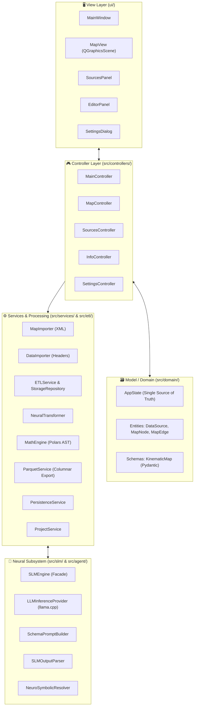

# 🏛️ SFusion Mapper: Technical Architecture & Design Principles

This document provides a comprehensive technical breakdown of the architecture, design patterns, and layer boundaries of **SFusion Mapper**.

⬅️ Back to [Main Documentation Hub](SFUSION_MOC.md) | ⚡ See [ETL Pipeline](ETL_PIPELINE.md) | 📐 See [Math Engine](MATH_ENGINE.md) | 🧠 See [Neural Pipeline](NEURAL_PIPELINE.md)

---

## 🏛️ High-Level Architectural Pattern

The application is engineered in Python 3 using **PySide6 (Qt6)**, adhering strictly to **Clean Architecture**, **SOLID** principles, and the **Model-View-Controller (MVC)** design pattern instantiated through the **Builder Pattern**:

---

## 🧩 Architectural Responsibilities

### 1. View Layer (`ui/`)
* **`MainWindow`**: Container hosting dockable panels, status bars, and menus.
* **`MapView`**: High-performance 2D vector graphics canvas (`QGraphicsView` / `QGraphicsScene`) rendering junctions, edges, lanes, and bidirectional pairs.
* **`SourcesPanel`**: Sensor directory tree inspector and ingestion tracker.
* **`EditorPanel`**: Visual mapping canvas displaying sensor columns against SUMO road attributes.
* **`SettingsDialog`**: Hardware offload controls (CUDA layers, GPU selection, context window).

### 2. Controller Layer (`src/controllers/` & `src/main_controller.py`)
* Mediates between asynchronous background services and UI events.
* Maintains decoupled signal routing via Qt Signals and Slots.
* Implements the **Mediator Pattern** ensuring Views never communicate directly with domain models.

### 3. Model & Domain Layer (`src/domain/`)
* **`AppState`**: Reactive, thread-safe Single Source of Truth (SSOT).
* **Entities**: Typed domain classes (`DataSource`, `MapNode`, `MapEdge`, `Lane`).
* **`KinematicMap`**: Pydantic v2 specification defining schema transformation contracts.

### 4. Service & ETL Processing Layer (`src/services/` & `src/etl/`)
* **`SensorBatchProcessor`**: Multi-threaded sensor parser with MD5 duplicate detection and zlib compression.
* **`ETLStorageRepository`**: Thread-safe SQLite WAL transaction manager for temporary Bronze/Silver staging.
* **`MathEngine`**: Vectorized Polars AST compiler executing unit normalization ($km/h$, $m/s$, $mph$) and harmonic mean speeds.
* **`ParquetService`**: Columnar aggregator compiling Gold-level Parquet datasets.
* **`MapImporter` & `DataImporter`**: Background XML and sensor header parsers.
* **`PersistenceService` & `ProjectService`**: Staging SQLite generation and `.sfm.json` serialization.

### 5. Neural & SLM Subsystem (`src/slm/` & `src/agent/`)
* **`SLMEngine`**: Facade orchestrating schema discovery.
* **`LLMInferenceProvider`**: Manages `llama.cpp`, GPU layer offloading, and memory cleanup.
* **`SchemaPromptBuilder`**: Traverses hierarchical JSON/CSV keys and loads prompt templates.
* **`SLMOutputParser`**: Isolates reasoning `<think>` tags from output JSON.
* **`NeuroSymbolicResolver`**: Enforces physical candidate matching, unit deduction, and confidence scoring.

### 6. Utility Layer (`src/utils/`)
* **`CUDALoader` (`cuda_loader.py`)**: Auto-discovers and preloads pip-bundled NVIDIA runtime libraries.
* **`I18nManager` (`i18n.py`)**: Dual internationalization system (`locale/` for UI, `locale_backend/` for logs and workers).
* **`SLMTelemetry` (`slm_telemetry.py`)**: Real-time GPU VRAM, CPU, and RAM monitoring.
* **`ConfigManager` (`config.py`)**: Handles persistent application settings.

---

## 🔗 Related Documentation
* [Master MOC](SFUSION_MOC.md) - Knowledge Base Map of Content
* [Core Concepts](CORE_CONCEPTS.md) - Conceptual Foundations
* [System Workflow](SYSTEM_WORKFLOW.md) - 5-Phase System Workflow
* [Data Models](DATA_MODELS.md) - Schemas, SQLite Tables, and Parquet Specification
* [ETL Pipeline](ETL_PIPELINE.md) - High-Performance Ingestion Engine
* [Math Engine](MATH_ENGINE.md) - Vector Physics and AST Compilation
* [Neural Pipeline](NEURAL_PIPELINE.md) - Small Language Model Integration
* [Hardware & CUDA](HARDWARE_AND_CUDA.md) - Hardware Acceleration Guide
* [Developer Guides](DEVELOPER_GUIDES.md) - Development and Setup Guide
* [Deployment & Packaging](DEPLOYMENT_AND_PACKAGING.md) - PyInstaller & Docker
* [Testing & QA](TESTING.md) - Automated Testing & Quality Assurance (160 tests, >91% coverage)

---

   
  <b>Noxfort Systems</b> — <i>A State Of Art Company</i> 
  <i>SYNAPSE Fusion (SFusion) Mapper • Version 0.1.0</i> 
  <small>© 2026 Noxfort Systems. Licenciado sob AGPLv3.</small>

