# 📖 Core Concepts

The **SFusion Mapper** is the "Day Zero" visual configuration and data engineering tool for the larger **SFusion ETL Ecosystem**. Its primary mission is to bridge the chasm between messy, heterogeneous urban sensor data and strict microscopic traffic simulation environments (such as SUMO).

> [!NOTE]
> To see how these concepts are applied in operational practice, refer to [[docs/SYSTEM_WORKFLOW]] and [[docs/USER_GUIDE]].

---

## 1. The "Day Zero" Paradigm

In traditional data engineering pipelines, configuring ETL jobs for smart cities requires writing custom scripts, regex parsers, and hardcoded database mappings for every new dataset. When a sensor vendor changes a column name or format, the pipeline crashes.

**SFusion Mapper eliminates hardcoded ETL**:
* It operates as a visual "Day Zero" staging interface.
* Users load a network topology and connect raw data sources interactively.
* The system resolves schemas automatically via AI, provides visual validation, and generates a standardized, production-grade **Apache Parquet dataset** ready for headless simulation and machine learning engines.

---

## 2. Network Topology & Spatial Association

Urban mobility data is meaningless without physical geographic context. SFusion imports microscopic simulation road networks from SUMO (`.net.xml` and `.net.xml.gz`) and models them as a formal mathematical graph:

* **Nodes (`MapNode`)**: Represent intersections, roundabouts, and junctions, defined by spatial coordinates $(x, y)$, node types, and human-readable aliases.
* **Edges (`MapEdge`)**: Represent directional road segments containing geometry shapes (`List[Tuple[float, float]]`), connected from a source node to a target node.
* **Intelligent Edge Pairing**: Real-world roads typically contain two opposing traffic flows. SFusion automatically identifies and pairs directional edges (e.g., `edge_123` and `-edge_123`), enabling unified street naming and simultaneous sensor assignment.
* **Global vs. Local Mapping**:
  * **Global Association**: Binds a data source to the entire simulation network (e.g., weather feeds, city-wide speed limits, or ambient temperature).
  * **Local Association**: Links a data stream to a specific road segment or intersection (e.g., a loop detector, radar camera, or corridor speed sensor).

---

## 3. Neuro-Symbolic Schema Discovery

Heterogeneous sensor streams use inconsistent naming conventions: one camera reports `spd_kmh`, another reports `current_speed`, and a third reports `v_average`.

SFusion employs a **neuro-symbolic** methodology:
* **The Neural Component**: A local Small Language Model (SLM) — *Phi-4-mini* — analyzes raw sample headers and data structures, interpreting semantic context.
* **The Symbolic Component**: The output is strictly constrained by a deterministic resolver ([[docs/NEURAL_PIPELINE|NeuroSymbolicResolver]]) to match the typed [[docs/DATA_MODELS#kinematic-schema|KinematicMap]] blueprint. This prevents LLM hallucinations, verifies candidate column validity, and deduces unit of measurement metadata.

---

## 4. Vectorized Kinematic Normalization

Simulations require standard SI / SUMO physical units:
$$\text{Speed } (v) \in \text{km/h}, \quad \text{Flow } (q) \in \text{veh/h}, \quad \text{Density } (k) \in \text{veh/km}$$

Rather than running slow row-by-row Python loops, SFusion uses the [[docs/MATH_ENGINE|MathEngine]] to compile the schema blueprint directly into an **Abstract Syntax Tree (AST)** of **Polars expressions** (`pl.Expr`). These expressions execute in parallel on multi-core CPUs with memory safety and SIMD vectorization.

---

## 5. Medallion Ingestion Architecture

SFusion implements a streamlined Medallion data lake architecture:

```mermaid
flowchart LR
    subgraph Bronze["🥉 Bronze Layer"]
        B1["Raw Sensor Files"]
        B2["MD5 Hashing"]
        B3["zlib Compression"]
        B4["raw_data_storage Table"]
    end

    subgraph Silver["🥈 Silver Layer"]
        S1["orjson Event Parsing"]
        S2["Polars AST Normalization"]
        S3["SQLite WAL Staging"]
    end

    subgraph Gold["🥇 Gold Layer"]
        G1["Columnar Consolidation"]
        G2["Parquet Dataset (.parquet)"]
        G3["Staging DB Auto-Cleanup"]
    end

    Bronze --> Silver --> Gold
```

1. **Bronze**: Raw payloads are archived with cryptographic integrity (MD5) and compressed for auditability.
2. **Silver**: Data is parsed into normalized, typed event records stored in SQLite WAL staging tables.
3. **Gold**: High-performance Apache Parquet columnar files are generated for downstream AI and simulation workloads, and the temporary staging database is completely unlinked.

---

## 🔗 Related Documentation
* [[docs/INDEX]] - Knowledge Base Map of Content
* [[ARCHITECTURE]] - High-level MVC & Builder Pattern
* [[docs/SYSTEM_WORKFLOW]] - Complete 5-Phase System Workflow
* [[docs/DATA_MODELS]] - Entities, Schemas, and Parquet Specification
* [[docs/ETL_PIPELINE]] - Multi-threaded Ingestion Engine
