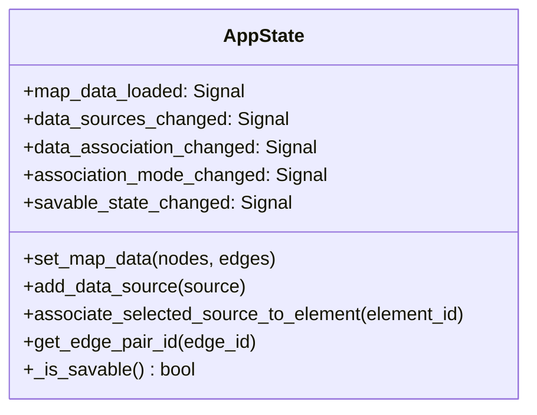

# 🗃️ Data Models & Schemas

This document provides the complete data dictionary for **SFusion Mapper**, detailing in-memory domain models, reactive state management, the mathematical blueprint schema, SQLite staging tables, the project persistence format, and the final unified **Apache Parquet** specification.

> [!NOTE]
> For information on how these models are transformed during execution, see [[docs/ETL_PIPELINE]] and [[docs/MATH_ENGINE]].

---

## 1. Domain Entities (`src/domain/entities.py`)

The application models the domain through immutable dataclasses and strict enums:

### `AssociationType` (Enum)
Defines how a registered sensor dataset is bound to the simulation topology:
* `UNASSOCIATED`: Sensor loaded but not assigned to any network entity.
* `GLOBAL`: Sensor parameters apply uniformly across the entire map.
* `LOCAL`: Sensor data is bound to a specific road segment (`MapEdge`) or intersection (`MapNode`).

### `DataSource` (Dataclass)
```python
@dataclass
class DataSource:
    path: str                                # Absolute path to source directory
    name: str                                # Human-readable display name
    file_types: list[str] = field(...)       # Detected formats (e.g. ["JSON", "CSV"])
    id: str = field(...)                     # Unique identifier (e.g. "src_a1b2c3d4")
    parser_id: str | None = None             # Assigned parser/extractor ID
    association_type: AssociationType = ...  # UNASSOCIATED, GLOBAL, or LOCAL
    associated_element_id: str | None = None # Target MapEdge or MapNode ID
```

### `MapNode` & `MapEdge` (Dataclasses)
```python
@dataclass
class MapNode:
    id: str                                  # SUMO junction ID (e.g. "J1")
    x: float                                 # X coordinate in network projection
    y: float                                 # Y coordinate in network projection
    node_type: str = "unknown"               # Junction type (traffic_light, priority, etc.)
    real_name: str | None = None             # User-assigned street/crossing name

@dataclass
class MapEdge:
    id: str                                  # SUMO road segment ID (e.g. "edge_42")
    from_node: str                           # Origin junction ID
    to_node: str                             # Destination junction ID
    shape: List[Tuple[float, float]] = ...   # Polyline coordinates for map drawing
    real_name: str | None = None             # Human-readable avenue/street name
```

---

## 2. Reactive Application State (`src/domain/app_state.py`)

The `AppState` class serves as the **Single Source of Truth (SSOT)** for the entire application, inheriting from PySide6 `QObject`. It decouples business logic from views using Qt Signals:



* **Savable Invariant (`_is_savable`)**: An export can only be triggered if (1) a map is loaded, and (2) all registered `LOCAL` sources are bound to at least one network element.

---

## 3. Kinematic Schema Blueprint (`src/core/schemas.py`)

The `KinematicMap` is a **Pydantic v2 BaseModel** acting as the mathematical contract between the AI schema inference and the vector physics engine:

```python
class KinematicMap(BaseModel):
    """
    Strongly typed blueprint populated by Phi-4-mini and validated
    by NeuroSymbolicResolver to drive Polars AST compilation.
    """
    # Direct Kinematic Columns
    speed_col: Optional[str] = None          # Speed column in raw data
    flow_col: Optional[str] = None           # Flow/volume column in raw data
    intensity_col: Optional[str] = None      # Density/jam index column

    # Base Derivation Columns
    distance_col: Optional[str] = None       # Distance column (for v = d / t)
    time_col: Optional[str] = None           # Duration/time column (for v = d / t)
    occupancy_col: Optional[str] = None      # Sensor occupancy/dwell time

    # Measurement Unit Metadata
    speed_unit: Optional[str] = "km/h"       # "km/h", "m/s", or "mph"
    occupancy_unit: Optional[str] = None     # "ms", "s", or "pct"
    distance_unit: Optional[str] = None      # "m", "km", or "miles"
    time_unit: Optional[str] = None          # "s", "ms", "min", or "hours"

    # Confidence Metadata
    confidence_score: Optional[float] = None # Model confidence [0.0 - 1.0]
```

---

## 4. SQLite Staging Database Schema

During the ETL ingestion phase, a temporary staging database is maintained with the following schema:

```sql
-- Junction Metadata Table
CREATE TABLE node_metadata (
    sumo_id TEXT PRIMARY KEY,
    real_name TEXT
);

-- Road Segment Metadata Table
CREATE TABLE edge_metadata (
    sumo_id TEXT PRIMARY KEY,
    real_name TEXT
);

-- Sensor Configuration & Association Mapping
CREATE TABLE data_associations (
    source_name TEXT PRIMARY KEY,
    source_path TEXT NOT NULL,
    association_type TEXT NOT NULL,
    associated_element_id TEXT,
    file_types_json TEXT
);

-- Bronze Archive: Cryptographic Hashing and Compressed Raw Files
CREATE TABLE raw_data_storage (
    id INTEGER PRIMARY KEY AUTOINCREMENT,
    source_id TEXT NOT NULL,
    filename TEXT NOT NULL,
    file_extension TEXT,
    import_timestamp DATETIME DEFAULT CURRENT_TIMESTAMP,
    file_hash TEXT,                          -- MD5 checksum
    file_size_bytes INTEGER,
    raw_content BLOB                         -- zlib-compressed bytes (level 6)
);

-- Dynamic Silver Section Tables (Created per registered data source)
CREATE TABLE section_<sanitized_source_name> (
    id INTEGER PRIMARY KEY AUTOINCREMENT,
    event_timestamp DATETIME,
    sensor_id TEXT NOT NULL,
    data_payload TEXT,                       -- JSON payload with normalized physics
    raw_file_reference TEXT
);
```

---

## 5. Final Unified Parquet Schema (`.parquet`)

The primary deliverable of SFusion Mapper is a high-throughput, columnar **Apache Parquet file** containing consolidated, physics-normalized kinematic events:

| Column Name | Apache Arrow / Pandas Dtype | Nullable | Description |
| :--- | :--- | :---: | :--- |
| `event_timestamp` | `timestamp[ns, UTC]` | No | Normalized event timestamp in UTC. |
| `sensor_id` | `string` | No | Identifier of the originating sensor device or feed. |
| `sumo_id` | `string` | Yes | Mapped SUMO network edge/junction ID (`None` for Global). |
| `location_text` | `string` | Yes | Human-readable avenue/street name assigned in GUI. |
| `lat` | `float64` | Yes | Extracted latitude coordinate (WGS84). |
| `lon` | `float64` | Yes | Extracted longitude coordinate (WGS84). |
| `origin_type` | `string` | No | Mapping scope: `"LOCAL"` or `"GLOBAL"`. |
| `speed_val` | `Int64` | Yes | **Speed normalized to km/h** rounded to integer. |
| `flow_val` | `float64` | Yes | **Traffic flow rate in veh/h**, rounded to 2 decimals. |
| `intensity_val` | `float64` | Yes | **Congestion/intensity index**, rounded to 2 decimals. |
| `source_table` | `string` | No | Internal section table of origin (`section_<name>`). |

---

## 6. Project Persistence File Format (`.sfm.json`)

To preserve work sessions without compiling the final dataset, the entire project state is serialized to a JSON format:

```json
{
  "version": "1.0",
  "map_file": "/path/to/network.net.xml",
  "element_names": {
    "edge_123": "Main Avenue",
    "-edge_123": "Main Avenue",
    "J14": "Central Square Crossing"
  },
  "sources": [
    {
      "path": "/data/sensors/loop_detectors",
      "name": "Loop Detectors North",
      "association_type": "LOCAL",
      "associated_element_id": "edge_123",
      "file_types": ["CSV"]
    }
  ]
}
```

---

## 🔗 Related Documentation
* [[docs/INDEX]] - Knowledge Base Map of Content
* [[ARCHITECTURE]] - Technical Architecture
* [[docs/MATH_ENGINE]] - Vector Physics and AST Compilation
* [[docs/ETL_PIPELINE]] - Multi-threaded Ingestion Engine
* [[docs/NEURAL_PIPELINE]] - Small Language Model Integration
