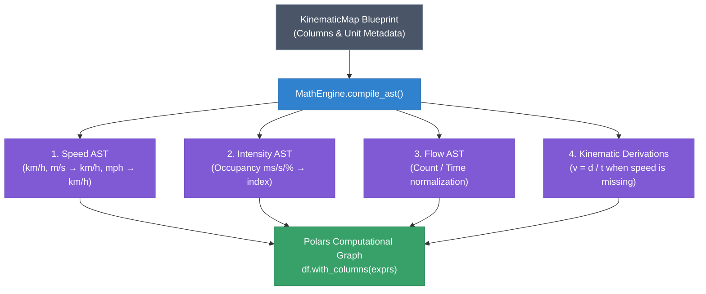

# 📐 Vector Physics Engine & AST Compiler

The **MathEngine** (`src/services/math_engine.py`) is the computational core responsible for deterministic traffic physics calculation and unit normalization within SFusion. It operates exclusively on CPU and RAM, leveraging **Polars** vector expressions to execute high-throughput transformations without Python GIL bottlenecks.

> [!NOTE]
> For integration details with the Small Language Model (SLM), see [[docs/NEURAL_PIPELINE]]. For overall ETL flow, see [[docs/ETL_PIPELINE]].

---

## 🎯 Purpose & Philosophy

Urban sensors report telemetry in wildly divergent units and formats:
* Speeds in `m/s`, `mph`, or `km/h`.
* Time stamps, durations, or delta-times in `seconds`, `milliseconds`, or `minutes`.
* Densities, jam indices, or occupancy percentages.

Simulators such as SUMO require deterministic, mathematically sound, normalized SI units:
* **Speed ($v$)**: $\text{km/h}$
* **Flow ($q$)**: $\text{veh/h}$
* **Density / Intensity ($k$)**: $\text{veh/km}$ or normalized index $[0.0, 1.0]$

The `MathEngine` receives the validated **Blueprint** ([[docs/DATA_MODELS#kinematic-schema|KinematicMap]]) inferred by the SLM or manually edited by the user, and compiles it into an **Abstract Syntax Tree (AST)** of native Polars expressions (`List[pl.Expr]`).

---

## ⚡ AST Compilation (`compile_ast`)

The core entry point is `MathEngine.compile_ast(schema: KinematicMap) -> List[pl.Expr]`.



### 1. Speed Normalization ($\text{km/h}$)
* If `speed_col` is present:
  * Unit `'m/s'`: $\text{speed} \times 3.6$
  * Unit `'mph'`: $\text{speed} \times 1.60934$
  * Unit `'km/h'`: $\text{speed}$ (identity cast to `Float64`)
* **Physical Fallback / Derivation**:
  If `speed_col` is missing, but both `distance_col` and `time_col` exist:
  $$\text{speed\_kmh} = \frac{\text{distance\_km}}{\text{time\_hours}}$$

### 2. Time & Distance Normalization
* **Distance**:
  * `'m'`: $\text{distance} / 1000.0$
  * `'miles'`: $\text{distance} \times 1.60934$
  * `'km'`: $\text{distance}$
* **Time**:
  * `'s'`: $\text{time} / 3600.0$
  * `'ms'`: $\text{time} / 3600000.0$
  * `'min'`: $\text{time} / 60.0$
  * `'hours'`: $\text{time}$

### 3. Intensity & Occupancy Normalization
* If `intensity_col` is available, it is converted to `Float64`.
* If missing, derived from `occupancy_col`:
  * `'ms'`: $\text{occupancy} / 1000.0$
  * `'pct'`: $\text{occupancy} / 100.0$
  * `'s'`: $\text{occupancy}$

---

## 🛡️ Anomaly Protection & Safe Arithmetic

To protect downstream simulations from crashing due to sensor dropouts or division by zero, `MathEngine` enforces:

1. **Safe Division (`safe_div`)**:
   ```python
   def safe_div(num_expr: pl.Expr, den_expr: pl.Expr) -> pl.Expr:
       return pl.when(den_expr == 0.0).then(pl.lit(None)).otherwise(num_expr / den_expr)
   ```
2. **Strict Floating Point Casting**: Strings and malformed numbers are cast with `strict=False`, safely turning corrupt data into `None`/`NaN` instead of raising uncaught runtime exceptions.
3. **Infinite and Negative Filtering**: Downstream export in `ParquetService` rounds values and replaces $\pm\infty$ with `np.nan`.

---

## 🔗 Related Documentation
* [[docs/INDEX]] - Knowledge Base Map of Content
* [[ARCHITECTURE]] - System Architecture
* [[docs/DATA_MODELS]] - KinematicMap Schema and Data Definitions
* [[docs/ETL_PIPELINE]] - High-Performance ETL Ingestion Pipeline
* [[docs/NEURAL_PIPELINE]] - Small Language Model Integration
