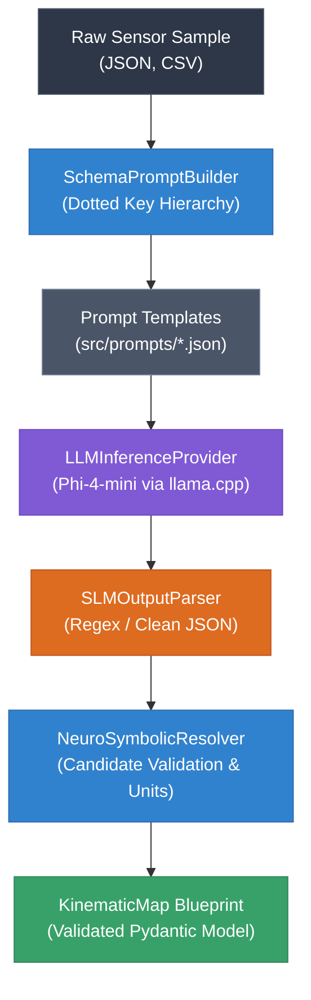

# 🧠 Neural Pipeline & SLM Engine

The **SFusion Neural Pipeline** implements an embedded, local **Neuro-Symbolic** framework to automate schema discovery across arbitrary urban mobility datasets. It is powered by a localized Small Language Model (SLM) — **Phi-4-mini-reasoning** — running via `llama.cpp` with full CUDA acceleration.

> [!NOTE]
> For hardware prerequisites and GPU configuration, see [[docs/HARDWARE_AND_CUDA]]. For the data schema output, see [[docs/DATA_MODELS#kinematic-schema]].

---

## 🔬 Neuro-Symbolic Architecture

Traditional approaches to schema mapping rely either on brittle regex rules (which break whenever column names change) or large cloud LLMs (which are expensive, slow, non-deterministic, and pose data privacy risks).

SFusion combines the best of both worlds:
1. **Neural Component**: The local SLM parses sample payloads and interprets human semantic intent (e.g., recognizing that `v_kmh`, `velocidade`, and `flowsegmentdata.currentspeed` all represent traffic speed).
2. **Symbolic Component**: A deterministic physics validator ([[#4-neuro-symbolic-resolver-srcslmneurosymbolicresolverpy|NeuroSymbolicResolver]]) validates candidate column names against mathematical rules, enforces measurement unit consistency, and compiles the result into a typed [[docs/DATA_MODELS#kinematic-schema|KinematicMap]].



---

## 🧩 Subsystem Modularization

Adhering strictly to **Single Responsibility (SRP)** and **Dependency Inversion (DIP)** principles, the AI subsystem is decoupled into four focused services managed by a unified facade:

### 1. High-Level Facade (`src/agent/slm_engine.py`)
* **Class**: `SLMEngine`
* Coordinates prompt creation, hardware inference, string parsing, and symbolic domain resolution.
* Exposes clean high-level methods: `discover_schema(raw_text, assoc_type)` and `infer_schema(raw_data)`.

### 2. Low-Level Inference Provider (`src/slm/llm_provider.py`)
* **Class**: `LLMInferenceProvider`
* Encapsulates the C++/CUDA `llama_cpp.Llama` runtime.
* Manages GPU offloading (`n_gpu_layers = -1`), context sizing (`n_ctx = 16384`), and FlashAttention.
* Enforces deterministic greedy decoding (`temperature = 0.0`) to eradicate non-deterministic hallucinations.
* Manages VRAM lifecycle: explicit `del` invocations, KV cache eviction, and `gc.collect()`.

### 3. Prompt Engineering & Key Extraction (`src/slm/prompt_builder.py`)
* **Class**: `SchemaPromptBuilder`
* Traverses nested JSON objects and lists, compiling flattened, dotted path representations (e.g., `features.properties.speed`).
* For CSV files, extracts column headers cleanly.
* Merges variables with system prompts stored in `src/prompts/`:
  * `schema_discovery.json`: Primary context instructions.
  * `assoc_instructions.json`: Behavioral constraints for Local vs Global mapping.
  * `kinematic_schema.json`: Formal JSON Schema defining acceptable fields.

### 4. Output Parsing & Sanitization (`src/slm/slm_output_parser.py`)
* **Class**: `SLMOutputParser`
* Handles reasoning models that output internal thoughts inside `<think>...</think>` tokens.
* Extracts the pure JSON object using regex patterns, discarding markdown code fences (````json ... ````) or conversational preambles.

### 5. Neuro-Symbolic Resolver (`src/slm/neuro_symbolic_resolver.py`)
* **Class**: `NeuroSymbolicResolver`
* Validates mapped columns against prioritized heuristic candidate dictionaries:
  ```python
  SPEED_CANDIDATES = ['estimated_speed_kmh', 'speed', 'currentspeed', 'velocity', 'velocidade', 'v']
  FLOW_CANDIDATES = ['flow', 'flow_rate', 'volume', 'vehicle_count', 'count', 'q']
  INTENSITY_CANDIDATES = ['density', 'jam_level', 'congestion_level', 'intensity', 'level', 'k']
  OCCUPANCY_CANDIDATES = ['occupancy_ms', 'occupancy_pct', 'occupancy', 'occ']
  ```
* Performs deterministic unit deduction (`infer_speed_unit`, `infer_time_unit`, `infer_distance_unit`).
* Calculates a normalized `confidence_score` based on schema completeness and field certainty.

---

## ⚡ Memory Safety & Resource Management

To prevent VRAM memory leaks when running schema discovery across hundreds of datasets:
1. **Isolated Context**: Each inference pass initializes fresh sequence slots and dumps KV cache tensors upon completion.
2. **Telemetry Tracking**: [src/utils/slm_telemetry.py](file:///home/gabriel-moraes/Documentos/SFUSION/src/utils/slm_telemetry.py) queries GPU utilization, temperature, and memory consumption, writing telemetric logs to `Sfusion_slm.log`.

---

## 🔗 Related Documentation
* [[docs/INDEX]] - Knowledge Base Map of Content
* [[ARCHITECTURE]] - Technical Architecture
* [[docs/HARDWARE_AND_CUDA]] - CUDA Runtime & GPU Acceleration
* [[docs/DATA_MODELS]] - Kinematic Schema Blueprint
* [[docs/MATH_ENGINE]] - Vector Physics Normalization
