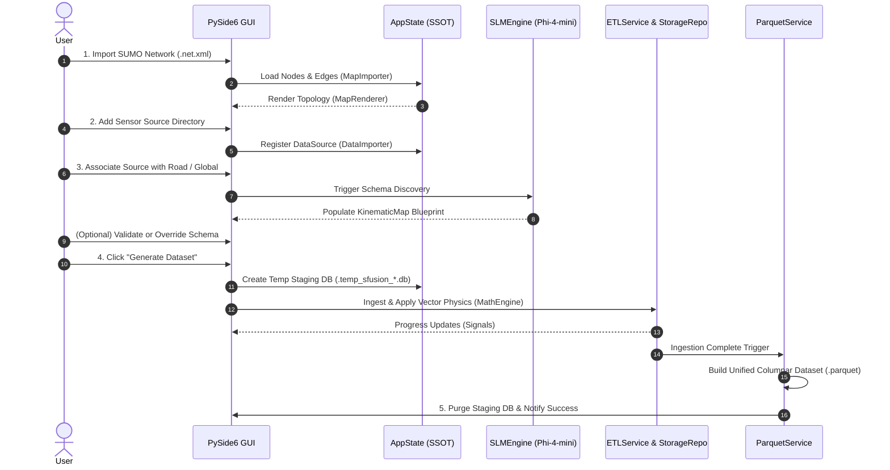

# 🔄 System Workflow & Data Lifecycle

The **SFusion Mapper** follows a deterministic, 5-phase lifecycle that transforms raw user inputs and unaligned sensor streams into an actionable, physics-validated **Apache Parquet dataset**.

> [!NOTE]
> For implementation specifics of each layer, see [[ARCHITECTURE]], [[docs/ETL_PIPELINE]], and [[docs/NEURAL_PIPELINE]].

---

## 🔁 End-to-End Workflow Diagram



---

## Phase 1: Map Topology Ingestion

1. **File Selection**: The user selects a SUMO network file (`.net.xml` or compressed `.net.xml.gz`).
2. **Asynchronous Parsing**: `MapImporter` parses the XML document in a background worker:
   * Extracts junctions and coordinates into [[docs/DATA_MODELS#domain-entities|MapNode]] entities.
   * Extracts road segments, shapes, and lane configurations into [[docs/DATA_MODELS#domain-entities|MapEdge]] entities.
   * Discovers bidirectional road pairs (e.g. `edge_1` and `-edge_1`).
3. **Reactive State Update**: `AppState` stores the graph and emits `map_data_loaded`.
4. **Rendering**: `MapRenderer` draws the vector network onto the PySide6 `QGraphicsScene`, enabling smooth pan and zoom interactions.

---

## Phase 2: Data Source Registration

1. **Folder Selection**: The user selects a directory containing sensor files (CSV, JSON, XML, or Excel).
2. **Header & Format Inspection**: `DataImporter` scans the directory recursively:
   * Detects supported file formats.
   * Samples records to extract field hierarchies.
3. **State Registration**: Generates a `DataSource` entity in `AppState` with initial status `UNASSOCIATED` and emits `data_sources_changed`.
4. **UI Presentation**: Populates the left-hand `SourcesPanel`.

---

## Phase 3: Association & Neuro-Symbolic Discovery

This phase establishes the semantic and spatial relationship between raw data and simulation roads:

1. **Association Trigger**:
   * **Local Mapping**: User drags a data source onto a map edge or uses the association button.
   * **Global Mapping**: User right-clicks a data source and sets it to Global.
2. **AI Schema Discovery**:
   * `NeuralTransformer` passes the sampled sensor content to `SLMEngine`.
   * `SchemaPromptBuilder` dynamically compiles prompt templates from `src/prompts/`.
   * The local model (*Phi-4-mini*) reasons about semantic column names (e.g., matching `v_med` to `speed_col`).
   * `NeuroSymbolicResolver` validates candidates against traffic physics heuristics and identifies measurement units (`km/h`, `m/s`, `mph`).
3. **User Review**:
   * The inferred [[docs/DATA_MODELS#kinematic-schema|KinematicMap]] is displayed in the right-hand `EditorPanel`.
   * The user can manually override any column selection via dropdown menus if desired.

---

## Phase 4: Staging ETL Ingestion

When the network is mapped and the user clicks **"Generate Dataset"**:

1. **Staging Initialization**: A hidden staging database is created:
   ```
   .temp_sfusion_<output_name>.db
   ```
2. **Metadata Snapshot**: `PersistenceService` creates metadata tables (`node_metadata`, `edge_metadata`, `data_associations`, `raw_data_storage`).
3. **Multi-Threaded Processing**:
   * `ETLService` launches `ETLWorker` on `QThreadPool`.
   * `SensorBatchProcessor` reads, hashes (MD5), and compresses (zlib) raw files into `raw_data_storage`.
   * Extracted events are normalized through [[docs/MATH_ENGINE|MathEngine]], executing Polars AST expressions in parallel to calculate standard physical values (`speed_val`, `flow_val`, `intensity_val`).
   * `ETLStorageRepository` commits batch transactions into sensor-specific tables (`section_<source_name>`) under SQLite WAL mode.
4. **Reactive Feedback**: The UI updates progress bars and status tips in real time.

---

## Phase 5: Columnar Export & Cleanup

1. **Parquet Consolidation**:
   * Once ingestion finishes, `ParquetService` reads all `section_*` tables.
   * Flattens JSON payloads, merges spatial metadata (`sumo_id`, `location_text`, `lat`, `lon`), and normalizes timestamps into UTC.
   * Exports the consolidated dataset to the final destination as an **Apache Parquet (`.parquet`)** file.
2. **Automated Staging Cleanup**:
   * `MainController._cleanup_temp_files()` deletes the hidden staging database and any accompanying SQLite write-ahead logging files (`.db`, `-wal`, `-shm`, `-journal`).
3. **Completion**: A success modal is displayed, and the UI re-enables interactive editing.

---

## 🔗 Related Documentation
* [[docs/INDEX]] - Knowledge Base Map of Content
* [[ARCHITECTURE]] - Technical Architecture
* [[docs/USER_GUIDE]] - Step-by-Step Operator Manual
* [[docs/ETL_PIPELINE]] - In-Depth ETL Pipeline Guide
* [[docs/MATH_ENGINE]] - Vector Physics Calculations
* [[docs/DATA_MODELS]] - Schema and Data Specifications
