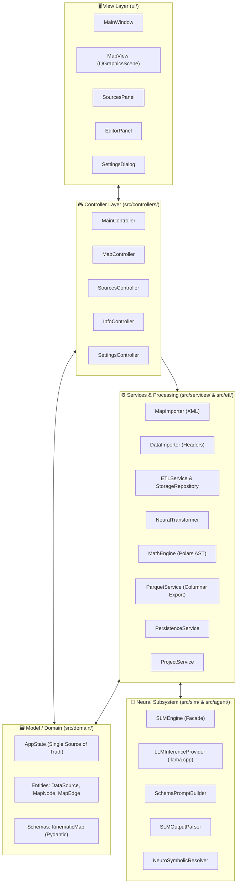

# 🏛️ Technical Architecture & Design Principles

This document provides a comprehensive technical breakdown of the architecture, design patterns, and layer boundaries of **SFusion Mapper**.

⬅️ [Documentation Hub](README.md) | 📖 [Core Concepts](core_concepts.md) | ⚡ [ETL Pipeline](etl_pipeline.md) | 🧪 [Testing](testing.md)

---

## 1. High-Level Architectural Pattern

The application is engineered in Python 3 using **PySide6 (Qt6)**, adhering strictly to **Clean Architecture**, **SOLID** principles, and the **Model-View-Controller (MVC)** design pattern instantiated through the **Builder Pattern**:

---

## 2. The Application Builder (`src/core/app_builder.py`)

To eliminate tight coupling and circular dependencies, SFusion enforces the **Builder Pattern** for dependency injection:

1. `AppBuilder._build_utils()`: Instantiates configuration and internationalization managers.
2. `AppBuilder._build_models()`: Initializes the central `AppState`.
3. `AppBuilder._build_services()`: Creates background workers, importers, ETL, and export services.
4. `AppBuilder._build_views()`: Constructs passive Qt widgets.
5. `AppBuilder._build_renderers()`: Binds the vector renderer (`MapRenderer`) to the graphics scene.
6. `AppBuilder._build_controllers()`: Wires controllers, injecting views, models, and services.
7. `AppBuilder._setup_connections()`: Connects Qt Signals and Slots across architectural boundaries.

---

## 3. Architectural Layer Specifications

### 3.1 View Layer (`ui/`)
Passive UI components that emit user interaction signals and render state representations:
* **`MainWindow`**: Main application window managing toolbars, status bars, and docking layout.
* **`MapView`**: Custom `QGraphicsView` providing interactive pan, zoom, and spatial element picking.
* **`SourcesPanel`**: Sidebar managing registered datasets, types, and association triggers.
* **`EditorPanel`**: Property inspector for manually adjusting inferred schema mappings and road names.
* **`SettingsDialog`**: Modal dialog for language, colors, and canvas limits.

### 3.2 Controller Layer (`src/controllers/` and `src/main_controller.py`)
Mediators translating view events into domain mutations and managing background execution:
* **`MainController`**: Handles project loading/saving, map import, and the 5-phase dataset generation pipeline.
* **`MapController`**: Handles canvas clicks, element selection, hover states, and edge pair highlighting.
* **`SourcesController`**: Synchronizes dataset list state, toggles between Global and Local modes.
* **`InfoController`**: Synchronizes the Editor Panel with selected network elements and updates road names.
* **`SettingsController`**: Persists UI configuration changes and manages restart prompts.

### 3.3 Model & Domain Layer (`src/domain/`)
* **`AppState`**: Single Source of Truth (SSOT). Emits reactive Qt Signals (`map_data_loaded`, `data_sources_changed`, `data_association_changed`, `savable_state_changed`).
* **Entities**: `DataSource`, `MapNode`, `MapEdge`, and `AssociationType`.
* **Schemas**: `KinematicMap` (Pydantic v2 mathematical blueprint).

### 3.4 Processing & Services Layer (`src/services/` & `src/etl/`)
* **`ETLService` & `ETLWorker`**: Multi-threaded ingestion engine coordinating sensor workers.
* **`SensorBatchProcessor`**: File I/O, MD5 hashing, zlib compression, and event extraction via `UniversalExtractor`.
* **`ETLStorageRepository`**: Thread-safe SQLite WAL persistence with PRAGMA tuning.
* **`MathEngine`**: Vector engine translating blueprints into native Polars AST expressions (`pl.Expr`) for SI unit normalization.
* **`NeuralTransformer`**: Intermediary caching layer linking SLM inference with mathematical execution.
* **`ParquetService`**: Columnar aggregator compiling Gold-level Parquet datasets.
* **`MapImporter` & `DataImporter`**: Background XML and sensor header parsers.
* **`PersistenceService` & `ProjectService`**: Staging SQLite generation and `.sfm.json` serialization.

### 3.5 Neural & SLM Subsystem (`src/slm/` & `src/agent/`)
* **`SLMEngine`**: Facade orchestrating schema discovery.
* **`LLMInferenceProvider`**: Manages `llama.cpp`, GPU layer offloading, and memory cleanup.
* **`SchemaPromptBuilder`**: Traverses hierarchical JSON/CSV keys and loads prompt templates.
* **`SLMOutputParser`**: Isolates reasoning `<think>` tags from output JSON.
* **`NeuroSymbolicResolver`**: Enforces physical candidate matching, unit deduction, and confidence scoring.

### 3.6 Utility Layer (`src/utils/`)
* **`CUDALoader`**: Auto-discovers and preloads pip-bundled NVIDIA runtime libraries.
* **`I18nManager`**: Dual internationalization system (`locale/` for UI, `locale_backend/` for logs and workers).
* **`SLMTelemetry`**: Real-time GPU VRAM, CPU, and RAM monitoring.
* **`ConfigManager`**: Handles persistent application settings.

---

## 🔗 Related Documentation
* [README](README.md) — Documentation Hub
* [Core Concepts](core_concepts.md) — Theoretical Foundations
* [Data Models](data_models.md) — Entities and Schemas
* [ETL Pipeline](etl_pipeline.md) — Ingestion Pipeline

---

   
  <b>Noxfort Systems</b> — <i>A State Of Art Company</i> 
  <i>Smart Mobility Engineering • SFusion Mapper v0.1.0</i> 
  <small>© 2026 Noxfort Systems. Licensed under AGPLv3.</small>

