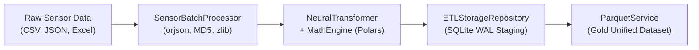

# ⚡ High-Performance ETL Pipeline

The **SFusion ETL Pipeline** is a multi-threaded, memory-efficient data ingestion engine designed to transform massive volumes of heterogeneous urban sensor records into standardized, physics-normalized kinematic datasets ready for simulation and AI consumption.

⬅️ [Documentation Hub](README.md) | 🏛️ [Architecture](architecture.md) | 📐 [Math Engine](math_engine.md)

---

## 1. Architectural Overview

The ETL subsystem sits at the boundary between raw sensor telemetry and downstream simulation engines. It utilizes a **three-tier Medallion ingestion pattern**:



1. **Bronze Layer (Raw Storage & Audit)**: Raw files are compressed via `zlib` (level 6), hashed using MD5 for deduplication, and preserved in the `raw_data_storage` table.
2. **Silver Layer (Normalized Staging)**: Events are parsed with `orjson`, evaluated through the `MathEngine` computational graph, and batched into thread-isolated sensor tables (`section_<source_name>`).
3. **Gold Layer (Columnar Export)**: The `ParquetService` flattens, enriches, and exports the unified time-series into high-throughput Apache Parquet format.

---

## 2. Core ETL Components

### 2.1 Ingestion Orchestrator (`src/services/etl_service.py`)
* **Class**: `ETLService` & `ETLWorker` (inherits from `QRunnable`)
* **Concurrency**: Managed via PySide6 `QThreadPool` combined with Python `ThreadPoolExecutor` for worker delegation.
* **Responsibilities**:
  * Orchestrates background execution without freezing the Qt GUI event loop.
  * Emits fine-grained Qt Signals: `progress(int)`, `total_calculated(int)`, `finished(str)`, and `error(str)`.
  * Controls batch sizing (`BATCH_SIZE = 500`) to guarantee predictable memory footprints.

### 2.2 Sensor Batch Processor (`src/etl/sensor_processor.py`)
* Ingests files using `UniversalExtractor` with C-accelerated `orjson` when available.
* Calculates binary checksums (`hashlib.md5`) and compresses file payloads with `zlib.compress(level=6)`.
* Passes extracted raw dictionaries through `NeuralTransformer` to inject normalized kinematic fields (`speed_val`, `flow_val`, `intensity_val`).

### 2.3 Storage Repository & SQLite Concurrency (`src/etl/storage_repository.py`)
* Thread-safe DAO implementing Write-Ahead Logging (WAL) PRAGMA tuning:
  ```sql
  PRAGMA journal_mode = WAL;
  PRAGMA busy_timeout = 120000;
  PRAGMA synchronous = NORMAL;
  PRAGMA cache_size = -64000;  -- 64MB shared page cache
  PRAGMA temp_store = MEMORY;
  ```
* Transactions are protected by `threading.Lock()` to eliminate database contention across worker threads.

---

## 3. Staging Database Lifecycle & Cleanup

1. A hidden staging database is created: `.temp_sfusion_<base_name>.db`.
2. Metadata and section tables are populated during worker batch execution.
3. Upon ingestion completion, `ParquetService` writes the unified `.parquet` file.
4. `MainController._cleanup_temp_files()` unlinks the staging database and all auxiliary files (`.db`, `-wal`, `-shm`, `-journal`).

---

## 🔗 Related Documentation
* [Documentation Hub](README.md)
* [Data Models](data_models.md)
* [System Workflow](system_workflow.md)
