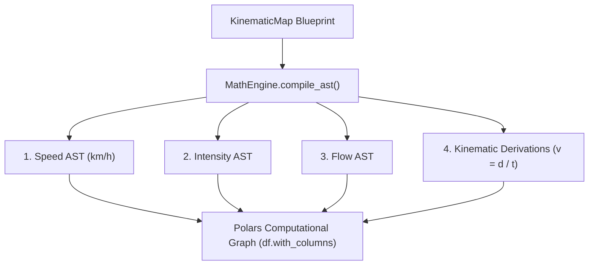

# 📐 Vector Physics Engine & AST Compiler

The **MathEngine** (`src/services/math_engine.py`) is the computational core responsible for deterministic traffic physics calculation and unit normalization within SFusion. It operates exclusively on CPU and RAM, leveraging **Polars** vector expressions to execute high-throughput transformations without Python GIL bottlenecks.

⬅️ [Documentation Hub](README.md) | 🏛️ [Architecture](architecture.md) | ⚡ [ETL Pipeline](etl_pipeline.md)

---

## 1. Purpose & SI Normalization

Urban sensors report telemetry in wildly divergent units:
* Speeds in `m/s`, `mph`, or `km/h`.
* Time stamps, durations, or delta-times in `seconds`, `milliseconds`, or `minutes`.
* Densities, jam indices, or occupancy percentages.

Simulators such as SUMO require deterministic, mathematically sound, normalized SI units:
* **Speed ($v$)**: $	ext{km/h}$
* **Flow ($q$)**: $	ext{veh/h}$
* **Density / Intensity ($k$)**: $	ext{veh/km}$ or normalized index $[0.0, 1.0]$

The `MathEngine` receives the validated `KinematicMap` blueprint and compiles it into an **Abstract Syntax Tree (AST)** of native Polars expressions (`List[pl.Expr]`).

---

## 2. AST Compilation (`compile_ast`)

* **Speed**:
  * `'m/s'`: $	ext{speed} 	imes 3.6$
  * `'mph'`: $	ext{speed} 	imes 1.60934$
  * `'knots'`: $	ext{speed} 	imes 1.852$
  * `'km/h'`: identity cast to `Float64`
  * Missing: derived via $	ext{speed} = rac{	ext{distance\_km}}{	ext{time\_hours}}$
* **Distance**: `'m'` $/ 1000.0$, `'miles'` $	imes 1.60934$, `'km'` identity.
* **Time**: `'s'` $/ 3600.0$, `'ms'` $/ 3600000.0$, `'min'` $/ 60.0$, `'hours'` identity.
* **Intensity / Occupancy**: `'ms'` $/ 1000.0$, `'pct'` $/ 100.0$, `'s'` identity.

---

## 3. Multi-Event Traffic Flow Aggregations (`compile_aggregations`)

### 1. Space Mean Speed (Harmonic Mean)
$$v_s = rac{N}{\sum_{i=1}^{N} rac{1}{v_i}}$$

### 2. Macroscopic Traffic Flow Rate ($q$)
$$q = rac{N}{\Delta t_{	ext{hours}}} \quad [	ext{veh/h}]$$

### 3. Traffic Density & Physical Intensity ($k$)
$$k = rac{q}{v_s} \quad [	ext{veh/km}]$$

---

## 4. Anomaly Protection & Safe Arithmetic

1. **Safe Division (`safe_div`)**: Replaces zero-denominators with `None` before computation.
2. **Permissive Casting**: Casts strings and numbers with `strict=False` to prevent uncaught runtime exceptions.
3. **Infinite Replacement**: Values equal to $\pm\infty$ are mapped to `np.nan` prior to integer rounding.

---

## 🔗 Related Documentation
* [Documentation Hub](README.md)
* [Neural Pipeline](neural_pipeline.md)
* [Data Models](data_models.md)

---

   
  <b>Noxfort Systems</b> — <i>A State Of Art Company</i> 
  <i>Smart Mobility Engineering • SFusion Mapper v0.1.0</i> 
  <small>© 2026 Noxfort Systems. Licensed under AGPLv3.</small>

