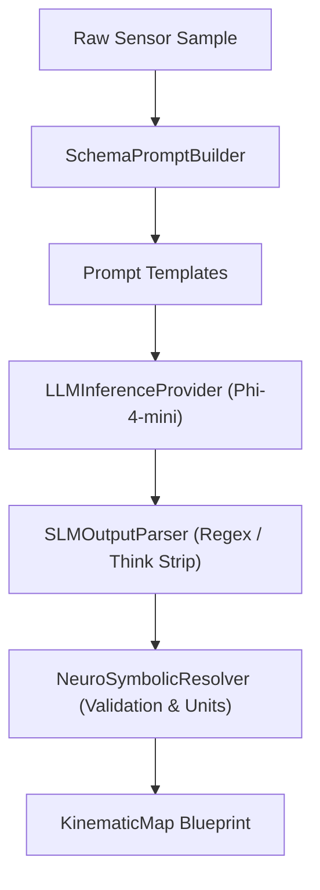

# 🧠 Neural Pipeline & SLM Engine

The **SFusion Neural Pipeline** implements an embedded, local **Neuro-Symbolic** framework to automate schema discovery across arbitrary urban mobility datasets. It is powered by a localized Small Language Model (SLM) — **Phi-4-mini-reasoning** — running via `llama.cpp` with full CUDA acceleration.

⬅️ [Documentation Hub](README.md) | 🏛️ [Architecture](architecture.md) | 🚀 [Hardware & CUDA](hardware_and_cuda.md)

---

## 1. Neuro-Symbolic Architecture

Traditional approaches to schema mapping rely either on brittle regex rules or expensive, non-deterministic cloud LLMs.

SFusion combines the best of both worlds:
1. **Neural Component**: The local SLM parses sample payloads and interprets human semantic intent (e.g., recognizing that `v_kmh`, `velocidade`, and `flowsegmentdata.currentspeed` all represent traffic speed).
2. **Symbolic Component**: A deterministic physics validator (`NeuroSymbolicResolver`) validates candidate column names against mathematical rules, enforces measurement unit consistency, and compiles the result into a typed `KinematicMap`.

---

## 2. AI Subsystem Components

1. **`SLMEngine` (`src/agent/slm_engine.py`)**: High-level facade coordinating prompt assembly, hardware inference, string parsing, and symbolic domain resolution.
2. **`LLMInferenceProvider` (`src/slm/llm_provider.py`)**: Encapsulates `llama_cpp.Llama`, GPU offloading (`n_gpu_layers = -1`), FlashAttention, and greedy decoding (`temperature = 0.0`).
3. **`SchemaPromptBuilder` (`src/slm/prompt_builder.py`)**: Traverses nested JSON/CSV objects, producing flattened dotted paths (e.g. `features.properties.speed`).
4. **`SLMOutputParser` (`src/slm/slm_output_parser.py`)**: Strips `<think>...</think>` tags from reasoning models and extracts valid JSON objects.
5. **`NeuroSymbolicResolver` (`src/slm/neuro_symbolic_resolver.py`)**: Evaluates candidate columns against heuristic dictionaries (`SPEED_CANDIDATES`, `FLOW_CANDIDATES`, `INTENSITY_CANDIDATES`), infers physical units, and calculates a normalized confidence score.

---

## 🔗 Related Documentation
* [Documentation Hub](README.md)
* [Hardware & CUDA](hardware_and_cuda.md)
* [Data Models](data_models.md)
