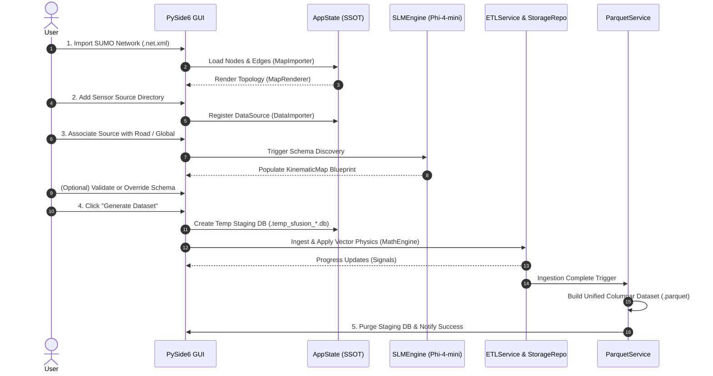

# 🔄 System Workflow & Data Lifecycle

The **SFusion Mapper** follows a deterministic, 5-phase lifecycle that transforms raw user inputs and unaligned sensor streams into an actionable, physics-validated **Apache Parquet dataset**.

⬅️ [Documentation Hub](README.md) | 🏛️ [Architecture](architecture.md) | 🖥️ [User Guide](user_guide.md)

---

## 1. End-to-End Workflow Diagram

---

## 2. Detailed Transformation Phases

### Phase 1: Map Topology Ingestion
* User selects standard `.net.xml` or compressed `.net.xml.gz` road network.
* `MapImporter` extracts junctions (`MapNode`) and directional roads (`MapEdge`).
* `AppState` stores the topology and `MapRenderer` draws the vector network on the PySide6 canvas.

### Phase 2: Data Source Registration
* User selects a folder containing sensor files (CSV, JSON, XML, Excel).
* `DataImporter` inspects headers, detects file formats, and registers a `DataSource` entity in `AppState`.

### Phase 3: Association & Neuro-Symbolic Discovery
* User associates a sensor with a road edge (Local) or applies it across the network (Global).
* `SLMEngine` prompts *Phi-4-mini* to infer semantic column mappings.
* `NeuroSymbolicResolver` validates candidates, assigns physical units, and generates the `KinematicMap` blueprint.

### Phase 4: Staging ETL Ingestion
* User clicks "Generate Dataset".
* Hidden SQLite staging database is created (`.temp_sfusion_<name>.db`).
* Multi-threaded `SensorBatchProcessor` compresses raw archives into Bronze storage, parses events into Silver staging tables, and evaluates Polars AST expressions in parallel.

### Phase 5: Columnar Export & Cleanup
* `ParquetService` consolidates all Silver tables, joins spatial metadata, formats timestamps in UTC, and writes the final Snappy-compressed Apache Parquet dataset.
* `MainController._cleanup_temp_files()` unlinks all temporary staging database files.

---

## 🔗 Related Documentation
* [Documentation Hub](README.md)
* [ETL Pipeline](etl_pipeline.md)
* [User Guide](user_guide.md)

---

   
  <b>Noxfort Systems</b> — <i>A State Of Art Company</i> 
  <i>Smart Mobility Engineering • SFusion Mapper v0.1.0</i> 
  <small>© 2026 Noxfort Systems. Licensed under AGPLv3.</small>

