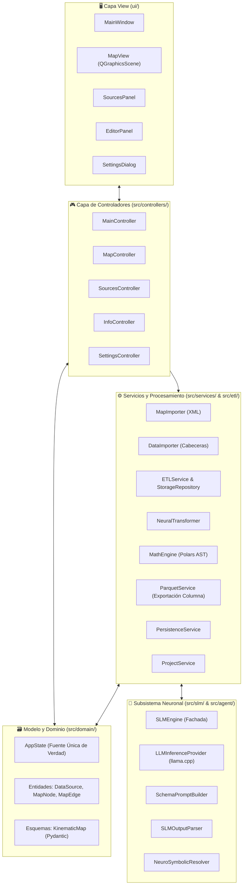

# 🏛️ Arquitectura del Sistema y Principios de Diseño

Este documento detalla la arquitectura de software, los patrones de diseño y la separación de capas de **SFusion Mapper**.

⬅️ [Centro de Documentación](README.md) | 📖 [Conceptos](core_concepts.md) | ⚡ [Pipeline ETL](etl_pipeline.md) | 🧪 [Pruebas](testing.md)

---

## 1. Patrón Arquitectónico de Alto Nivel

La aplicación está construida en Python 3 utilizando **PySide6 (Qt6)**, adhiriéndose a **Clean Architecture**, **SOLID** y el patrón **Model-View-Controller (MVC)** instanciado mediante el **Builder Pattern**:

---

## 2. El Constructor de la Aplicación (`src/core/app_builder.py`)

1. `AppBuilder._build_utils()`: Inicializa administradores de configuración e internacionalización.
2. `AppBuilder._build_models()`: Crea la instancia central de `AppState`.
3. `AppBuilder._build_services()`: Inicializa workers de segundo plano, importadores y exportadores Parquet.
4. `AppBuilder._build_views()`: Construye los widgets pasivos de Qt.
5. `AppBuilder._build_renderers()`: Conecta el renderizador vectorial (`MapRenderer`) a la escena.
6. `AppBuilder._build_controllers()`: Inyecta vistas, modelos y servicios en los controladores.
7. `AppBuilder._setup_connections()`: Vincula Señales y Ranuras (Signals/Slots) de Qt.

---

## 3. Especificación de Capas

### 3.1 Capa de Vista (`ui/`)
* **`MainWindow`**: Ventana principal que administra barras de herramientas y menús.
* **`MapView`**: `QGraphicsView` interactivo para inspección de redes viales.
* **`SourcesPanel`**: Lista de fuentes de datos detectadas y estado de vinculación.
* **`EditorPanel`**: Editor de propiedades cinemáticas y asignación de nombres de calles.
* **`SettingsDialog`**: Configuración de idiomas y visualización.

### 3.2 Capa de Controladores (`src/controllers/`)
* **`MainController`**: Coordinador del ciclo de vida general y pipeline de 5 fases.
* **`MapController`**: Gestión de clics en el mapa y emparejamiento de direcciones opuestas.
* **`SourcesController`**: Conmutación entre asociaciones Locales y Globales.
* **`InfoController`**: Enlace bidireccional entre selección en mapa y el panel editor.
* **`SettingsController`**: Persistencia de configuraciones en disco.

### 3.3 Capa de Dominio y Modelo (`src/domain/`)
* **`AppState`**: Fuente Única de Verdad (SSOT) reactiva.
* **Entidades**: `DataSource`, `MapNode`, `MapEdge` y enum `AssociationType`.
* **Esquemas**: `KinematicMap` (Pydantic v2).

### 3.4 Capa de Servicios y Procesamiento (`src/services/` & `src/etl/`)
* **`ETLService` & `ETLWorker`**: Ingesta multihilo ejecutada en `QThreadPool`.
* **`SensorBatchProcessor`**: E/S de archivos, compresión zlib y extracción con `UniversalExtractor`.
* **`ETLStorageRepository`**: Persistencia transaccional en SQLite con Write-Ahead Logging (WAL).
* **`MathEngine`**: Compilación de árboles sintácticos en Polars (`pl.Expr`) para unidades SI.
* **`ParquetService`**: Generador colunar del dataset consolidado `.parquet`.

---

## 🔗 Enlaces Relacionados
* [Centro de Documentación](README.md)
* [Conceptos Fundamentales](core_concepts.md)
* [Modelos de Datos](data_models.md)

---

   
  <b>Noxfort Systems</b> — <i>A State Of Art Company</i> 
  <i>Ingeniería de Movilidad Inteligente • SFusion Mapper v0.1.0</i> 
  <small>© 2026 Noxfort Systems. Licenciado bajo AGPLv3.</small>

