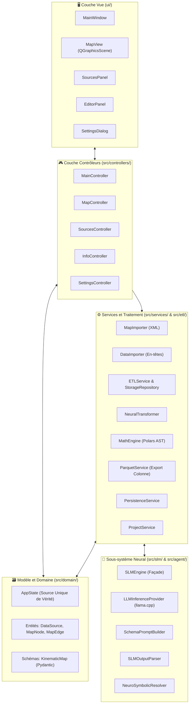

# 🏛️ Architecture Système et Principes d'Ingénierie

Ce document décrit l'architecture logicielle, les patrons de conception et le découpage en couches de **SFusion Mapper**.

⬅️ [Hub de Documentation](README.md) | 📖 [Concepts Fondamentaux](core_concepts.md) | ⚡ [Pipeline ETL](etl_pipeline.md) | 🧪 [Tests](testing.md)

---

## 1. Modèle Architectural Global

L'application est développée en Python 3 avec **PySide6 (Qt6)**, conformément aux principes de la **Clean Architecture**, des règles **SOLID** et du patron **Modèle-Vue-Contrôleur (MVC)** instancié par le patron **Builder** :

---

## 2. Le Constructeur d'Application (`src/core/app_builder.py`)

1. `AppBuilder._build_utils()` : Initialise la configuration et l'internationalisation.
2. `AppBuilder._build_models()` : Instancie le gestionnaire d'état réactif `AppState`.
3. `AppBuilder._build_services()` : Initialise les agents d'arrière-plan, les extracteurs et le service Parquet.
4. `AppBuilder._build_views()` : Construit les composants graphiques passifs.
5. `AppBuilder._build_renderers()` : Associe le moteur de rendu vectoriel (`MapRenderer`) à la scène.
6. `AppBuilder._build_controllers()` : Injecte vues, modèles et services dans les contrôleurs.
7. `AppBuilder._setup_connections()` : Établit les liaisons entre Signaux et Slots Qt.

---

## 3. Découpage en Couches

### 3.1 Couche de Vue (`ui/`)
* **`MainWindow`** : Fenêtre principale avec barre d'outils, statuts et panneaux latéraux.
* **`MapView`** : Vue `QGraphicsView` interactive pour la navigation vectorielle sur le réseau SUMO.
* **`SourcesPanel`** : Liste des répertoires de capteurs enregistrés et types de fichiers.
* **`EditorPanel`** : Inspecteur de paramètres cinématiques et renommage des voies.
* **`SettingsDialog`** : Boîte modale des réglages linguistiques et graphiques.

### 3.2 Couche Contrôleur (`src/controllers/`)
* **`MainController`** : Orchestrateur central du cycle de vie et du pipeline en 5 phases.
* **`MapController`** : Gestion des sélections et de l'appariement des voies opposées.
* **`SourcesController`** : Basculement entre modes d'association Local et Global.
* **`InfoController`** : Synchronisation entre éléments sélectionnés et l'éditeur.
* **`SettingsController`** : Sauvegarde des préférences utilisateur.

### 3.3 Couche Domaine et Modèle (`src/domain/`)
* **`AppState`** : Source Unique de Vérité (SSOT) réactive.
* **Entités** : `DataSource`, `MapNode`, `MapEdge` et l'énumération `AssociationType`.
* **Schémas** : `KinematicMap` (Pydantic v2).

### 3.4 Couche de Traitement et Services (`src/services/` & `src/etl/`)
* **`ETLService`** : Moteur d'ingestion multithread piloté par `QThreadPool`.
* **`SensorBatchProcessor`** : E/S disques, hachage MD5 et compression zlib.
* **`ETLStorageRepository`** : Persistance transactionnelle en SQLite WAL.
* **`MathEngine`** : Compilateur d'expressions Polars AST (`pl.Expr`) vers les unités SI.
* **`ParquetService`** : Génération du jeu de données final en Apache Parquet.

---

## 🔗 Liens Utiles
* [Hub de Documentation](README.md)
* [Concepts Fondamentaux](core_concepts.md)
* [Modèles de Données](data_models.md)
