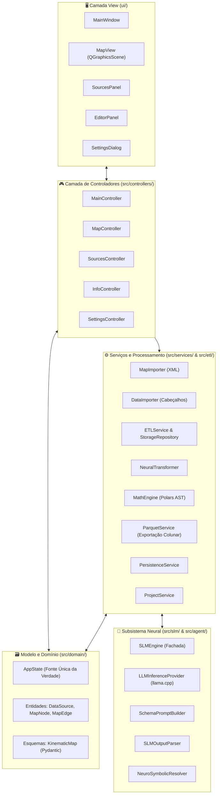

# 🏛️ Arquitetura do Sistema e Princípios de Engenharia

Este documento especifica a arquitetura técnica, os padrões de projeto e a separação em camadas do **SFusion Mapper**.

⬅️ [Central de Documentação](README.md) | 📖 [Conceitos Fundamentais](core_concepts.md) | ⚡ [Pipeline ETL](etl_pipeline.md) | 🧪 [Testes](testing.md)

---

## 1. Padrão Arquitetural de Alto Nível

A aplicação é desenvolvida em Python 3 utilizando **PySide6 (Qt6)**, seguindo os princípios de **Clean Architecture**, **SOLID** e o padrão **Model-View-Controller (MVC)** instanciado por meio do **Builder Pattern**:

---

## 2. O Construtor da Aplicação (`src/core/app_builder.py`)

Para eliminar acoplamentos rígidos e dependências circulares, o SFusion implementa o **Padrão Builder** para injeção de dependências:

1. `AppBuilder._build_utils()`: Inicializa gerenciadores de configuração e internacionalização.
2. `AppBuilder._build_models()`: Constrói a instância central do `AppState`.
3. `AppBuilder._build_services()`: Inicializa workers em background, importadores, ETL e serviço Parquet.
4. `AppBuilder._build_views()`: Constrói os componentes visuais passivos em Qt.
5. `AppBuilder._build_renderers()`: Vincula o renderizador vetorial (`MapRenderer`) à cena gráfica.
6. `AppBuilder._build_controllers()`: Conecta controladores injetando views, modelos e serviços.
7. `AppBuilder._setup_connections()`: Interliga Sinais e Slots do Qt através das fronteiras arquiteturais.

---

## 3. Especificação das Camadas

### 3.1 Camada de Visualização (`ui/`)
Componentes passivos de interface gráfica que emitem sinais de interação e exibem o estado:
* **`MainWindow`**: Janela principal gerenciando barras de ferramentas, status e docas.
* **`MapView`**: `QGraphicsView` customizado para pan, zoom e seleção espacial de elementos da malha.
* **`SourcesPanel`**: Painel lateral para fontes de dados cadastradas, formatos e associações.
* **`EditorPanel`**: Inspetor de propriedades para ajuste de mapeamentos do SLM e nomes reais de vias.
* **`SettingsDialog`**: Caixa modal para ajuste de idioma, paleta de cores e limites de zoom.

### 3.2 Camada de Controle (`src/controllers/` e `src/main_controller.py`)
Mediadores que traduzem eventos visuais em mutações de domínio e gerenciam tarefas assíncronas:
* **`MainController`**: Coordena carga/salvamento de projetos, importação de rede e o pipeline de 5 fases.
* **`MapController`**: Gerencia cliques, seleção, realce de vias opostas e estados de hover.
* **`SourcesController`**: Sincroniza lista de fontes e alternância entre modos Local e Global.
* **`InfoController`**: Atualiza o painel editor com o elemento viário selecionado.
* **`SettingsController`**: Persiste alterações de configuração e notifica necessidade de reinício.

### 3.3 Camada de Domínio e Modelo (`src/domain/`)
* **`AppState`**: Fonte Única da Verdade (SSOT). Emite sinais reativos Qt (`map_data_loaded`, `data_sources_changed`, `data_association_changed`, `savable_state_changed`).
* **Entidades**: `DataSource`, `MapNode`, `MapEdge` e `AssociationType`.
* **Esquemas**: `KinematicMap` (blueprint matemático validado via Pydantic v2).

### 3.4 Camada de Serviços e Processamento (`src/services/` & `src/etl/`)
* **`ETLService` & `ETLWorker`**: Motor de ingestão multithread gerenciado via `QThreadPool`.
* **`SensorBatchProcessor`**: E/S de arquivos, cálculo de MD5, compressão zlib e extração com `UniversalExtractor`.
* **`ETLStorageRepository`**: Repositório de persistência SQLite WAL com afinação de PRAGMA.
* **`MathEngine`**: Compilador de expressões nativas Polars AST (`pl.Expr`) para unidades SI.
* **`NeuralTransformer`**: Camada intermediária de cache que conecta inferência SLM à física vetorial.
* **`ParquetService`**: Consolidador colunar que grava o arquivo final `.parquet` com Snappy.

---

## 🔗 Documentos Relacionados
* [Central de Documentação](README.md)
* [Conceitos Fundamentais](core_concepts.md)
* [Modelos de Dados](data_models.md)
* [Pipeline ETL](etl_pipeline.md)

---

   
  <b>Noxfort Systems</b> — <i>A State Of Art Company</i> 
  <i>Engenharia de Mobilidade Inteligente • SFusion Mapper v0.1.0</i> 
  <small>© 2026 Noxfort Systems. Licenciado sob AGPLv3.</small>

