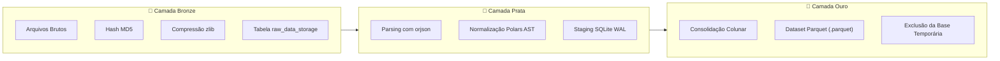

# 📖 Conceitos Fundamentais e Teoria

O **SFusion Mapper** é a ferramenta visual de engenharia de dados "Day Zero" do ecossistema **SFusion ETL**. Sua missão primordial é transformar dados de sensores urbanos heterogêneos e desestruturados em conjuntos de dados cinemáticos calibrados para simuladores microscópicos estritos (como o SUMO).

⬅️ [Central de Documentação](README.md) | 🏛️ [Arquitetura](architecture.md) | 🔄 [Fluxo de Trabalho](system_workflow.md)

---

## 1. O Paradigma "Day Zero"

Em pipelines tradicionais de engenharia de tráfego, conectar novos conjuntos de dados exige scripts artesanais, expressões regulares frágeis e mapeamentos manuais de banco de dados. Qualquer alteração de cabeçalho por um fabricante de radar quebra a esteira de dados.

**O SFusion Mapper extingue o ETL artesanal**:
* Atua como console visual de preparação e auditoria pré-simulação ("Day Zero").
* O operador carrega a malha SUMO e vincula diretórios de sensores graficamente.
* A IA local (*Phi-4-mini*) deduz os esquemas automaticamente com validação simbólica, gerando uma base de alta performance em **Apache Parquet** pronta para simulação e aprendizado por reforço.

---

## 2. Topologia Viária e Associação Espacial

Telemetria de tráfego é inútil sem ancoragem espacial rigorosa. O SFusion importa malhas viárias do SUMO (`.net.xml` e `.net.xml.gz`) e constrói um grafo matemático formal:

* **Vértices (`MapNode`)**: Cruzamentos e entroncamentos com coordenadas geográficas $(x, y)$ e tipos de junção.
* **Arestas (`MapEdge`)**: Vias direcionais com polilinhas geométricas (`shape`) conectando nós de origem e destino.
* **Pareamento Inteligente de Vias**: Vias urbanas reais possuem sentidos opostos. O SFusion detecta e agrupa automaticamente arestas inversas (ex: `edge_123` e `-edge_123`), permitindo atribuição unificada de nomes e sensores.
* **Mapeamento Local vs. Global**:
  * **Associação Global**: Vincula dados a toda a malha viária (ex: clima, temperatura ambiente, velocidade regulamentar geral).
  * **Associação Local**: Ancora medições a um segmento viário ou cruzamento específico (ex: radar de velocidade, laço indutivo).

---

## 3. Descoberta Neuro-Simbólica de Esquemas

Sensores de marcas diferentes nomeiam dados de formas imprevisíveis: uma câmera envia `spd_kmh`, outra `velocidade`, e uma terceira `currentSpeed`.

O SFusion combina IA neural com validação determinística:
* **Componente Neural**: O modelo SLM local (*Phi-4-mini*) analisa amostras brutas e deduz a intenção semântica.
* **Componente Simbólico**: O validador determinístico (`NeuroSymbolicResolver`) restringe a saída ao contrato tipado `KinematicMap`. Isso elimina alucinações, confere se as colunas realmente existem e deduz metadados de unidades de medida.

---

## 4. Normalização Cinemática Vetorial

Simuladores microscópicos exigem unidades físicas no padrão internacional (SI / SUMO):
$$\text{Velocidade } (v) \in \text{km/h}, \quad \text{Vazão } (q) \in \text{veíc/h}, \quad \text{Densidade } (k) \in \text{veíc/km}$$

Em vez de iterar linha por linha em loops lentos de Python, o SFusion compila a especificação em uma **Árvore Sintática Abstrata (AST)** de **expressões nativas do Polars** (`pl.Expr`), executadas em paralelo sobre múltiplos núcleos com vetorização SIMD.

---

## 5. Arquitetura Medalhão de Ingestão

---

## 🔗 Documentos Relacionados
* [Central de Documentação](README.md)
* [Modelos de Dados](data_models.md)
* [Motor Físico](math_engine.md)
* [Fluxo de Trabalho](system_workflow.md)

---

   
  <b>Noxfort Systems</b> — <i>A State Of Art Company</i> 
  <i>Engenharia de Mobilidade Inteligente • SFusion Mapper v0.1.0</i> 
  <small>© 2026 Noxfort Systems. Licenciado sob AGPLv3.</small>

