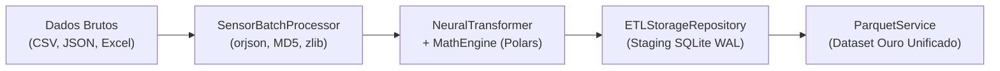

# ⚡ Pipeline ETL de Alta Performance

O **Pipeline ETL do SFusion** é um motor multithread de alta eficiência de memória, projetado para transformar volumes massivos de telemetria urbana despadronizada em bases cinemáticas normalizadas em padrão SI.

⬅️ [Central de Documentação](README.md) | 🏛️ [Arquitetura](architecture.md) | 📐 [Motor Físico](math_engine.md)

---

## 1. Visão Geral da Arquitetura

O subsistema opera na fronteira entre a telemetria bruta e os motores de simulação, adotando o **Padrão Medalhão em Três Níveis**:



1. **Camada Bronze (Armazenamento Bruto e Auditoria)**: Arquivos são comprimidos via `zlib` (nível 6), recebem hash MD5 para desduplicação e são persistidos na tabela `raw_data_storage`.
2. **Camada Prata (Staging Normalizado)**: Eventos são decodificados com `orjson`, transformados através do grafo computacional do `MathEngine` e inseridos em tabelas de sensores isoladas por fonte (`section_<nome>`).
3. **Camada Ouro (Exportação Colunar)**: O `ParquetService` descompacta, funde os metadados espaciais e exporta o dataset final em Apache Parquet com compressão Snappy.

---

## 2. Componentes Centrais do ETL

### 2.1 Orquestrador de Ingestão (`src/services/etl_service.py`)
* Executa via `QThreadPool` do PySide6 integrado com `ThreadPoolExecutor` para trabalhadores em background.
* Emite sinais Qt contínuos de progresso: `progress(int)`, `total_calculated(int)`, `finished(str)` e `error(str)`.
* Processa em lotes de 500 registros (`BATCH_SIZE = 500`) para garantir consumo estável de memória RAM.

### 2.2 Processador de Lotes (`src/etl/sensor_processor.py`)
* Faz a leitura de arquivos através do `UniversalExtractor` acelerado por C via `orjson`.
* Comprime os bytes brutos com `zlib.compress(level=6)` para auditoria forense.
* Invoca o `NeuralTransformer` para injetar os campos cinemáticos calculados (`speed_val`, `flow_val`, `intensity_val`).

### 2.3 Repositório de Staging SQLite (`src/etl/storage_repository.py`)
* Configurado com modo Write-Ahead Logging (WAL) de alto throughput:
  ```sql
  PRAGMA journal_mode = WAL;
  PRAGMA busy_timeout = 120000;
  PRAGMA synchronous = NORMAL;
  PRAGMA cache_size = -64000;  -- 64MB de cache compartilhado
  PRAGMA temp_store = MEMORY;
  ```
* Inserções protegidas por trava de exclusão mútua (`threading.Lock()`), eliminando bloqueios entre threads concorrentes.

---

## 3. Ciclo de Vida e Limpeza Automática do Banco

1. Ao acionar "Gerar Dataset", uma base oculta é criada: `.temp_sfusion_<nome>.db`.
2. Metadados e tabelas de seção são povoados pelas threads de trabalho.
3. Ao finalizar a ingestão, o `ParquetService` grava o arquivo `.parquet` consolidado.
4. O método `MainController._cleanup_temp_files()` remove automaticamente a base temporária e todos os arquivos auxiliares (`.db`, `-wal`, `-shm`, `-journal`).

---

## 🔗 Documentos Relacionados
* [Central de Documentação](README.md)
* [Modelos de Dados](data_models.md)
* [Fluxo de Trabalho](system_workflow.md)
