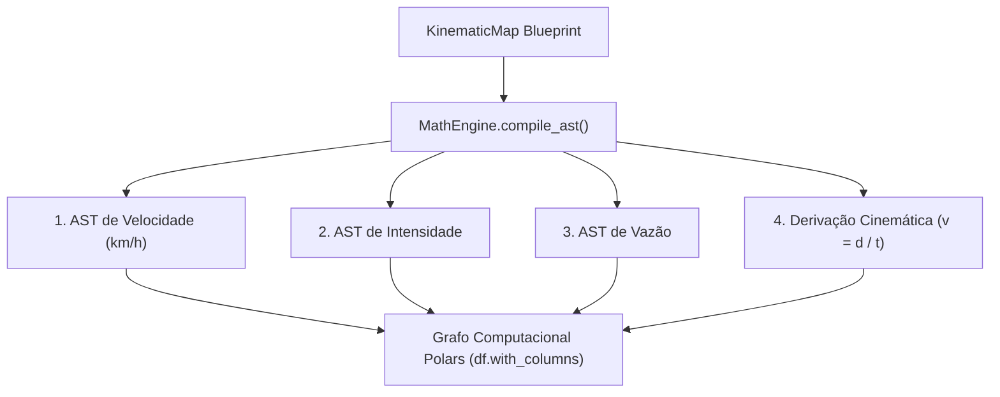

# 📐 Motor Físico Vetorial e Compilador AST

O **MathEngine** (`src/services/math_engine.py`) é o núcleo de cálculo e normalização cinemática determinística do SFusion. Ele opera exclusivamente em CPU e memória RAM, empregando expressões vetoriais do **Polars** para obter processamento massivo sem restrições do Python GIL.

⬅️ [Central de Documentação](README.md) | 🏛️ [Arquitetura](architecture.md) | ⚡ [Pipeline ETL](etl_pipeline.md)

---

## 1. Propósito e Normalização SI

Sensores urbanos transmitem dados em unidades incompatíveis:
* Velocidades em `m/s`, `mph` ou `km/h`.
* Intervalos de tempo em `segundos`, `milissegundos` ou `minutos`.
* Ocupação e intensidades em porcentagem ou contagens.

Simuladores viários como o SUMO exigem estritamente unidades normalizadas no Sistema Internacional (SI / SUMO):
* **Velocidade ($v$)**: $\text{km/h}$
* **Vazão ($q$)**: $\text{veíc/h}$
* **Densidade / Intensidade ($k$)**: $\text{veíc/km}$ ou índice normalizado $[0.0, 1.0]$

O `MathEngine` recebe o blueprint validado (`KinematicMap`) e o compila em uma **Árvore Sintática Abstrata (AST)** de expressões nativas do Polars (`List[pl.Expr]`).

---

## 2. Compilação AST Linha a Linha (`compile_ast`)

* **Velocidade**:
  * `'m/s'`: $\text{velocidade} \times 3.6$
  * `'mph'`: $\text{velocidade} \times 1.60934$
  * `'knots'`: $\text{velocidade} \times 1.852$
  * `'km/h'`: conversão direta para `Float64`
  * Ausente: derivado por $\text{velocidade} = \frac{\text{distancia\_km}}{\text{tempo\_horas}}$
* **Distância**: `'m'` $/ 1000.0$, `'miles'` $\times 1.60934$, `'km'` identidade.
* **Tempo**: `'s'` $/ 3600.0$, `'ms'` $/ 3600000.0$, `'min'` $/ 60.0$, `'hours'` identidade.
* **Intensidade / Ocupação**: `'ms'` $/ 1000.0$, `'pct'` $/ 100.0$, `'s'` identidade.

---

## 3. Agregações Macroscópicas de Tráfego (`compile_aggregations`)

### 1. Velocidade Média Espacial (Média Harmônica)
Em engenharia de tráfego, a média aritmética superestima a velocidade média da corrente. O SFusion calcula a **Velocidade Média Espacial ($v_s$)** pela média harmônica:
$$v_s = \frac{N}{\sum_{i=1}^{N} \frac{1}{v_i}}$$

### 2. Vazão Macroscópica de Tráfego ($q$)
A vazão converte o número de veículos detectados para a escala horária ($\text{veíc/h}$):
$$q = \frac{N}{\Delta t_{\text{horas}}}$$

### 3. Densidade e Intensidade Física ($k$)
A densidade é derivada da equação hidrodinâmica fundamental do tráfego ($q = k \cdot v$):
$$k = \frac{q}{v_s} \quad [\text{veíc/km}]$$

---

## 4. Proteção contra Anomalias e Aritmética Segura

1. **Divisão Segura (`safe_div`)**: Substitui denominadores nulos ($0.0$) por `None` antes do cálculo, evitando divisão por zero.
2. **Casting Permissivo**: Conversões numéricas utilizam `strict=False`, transformando valores corrompidos em `None`/`NaN` sem interromper o processo.
3. **Filtro de Infinitos**: Valores avaliados como $\pm\infty$ são convertidos para `np.nan` antes do arredondamento para inteiros.

---

## 🔗 Documentos Relacionados
* [Central de Documentação](README.md)
* [Pipeline Neural](neural_pipeline.md)
* [Modelos de Dados](data_models.md)
