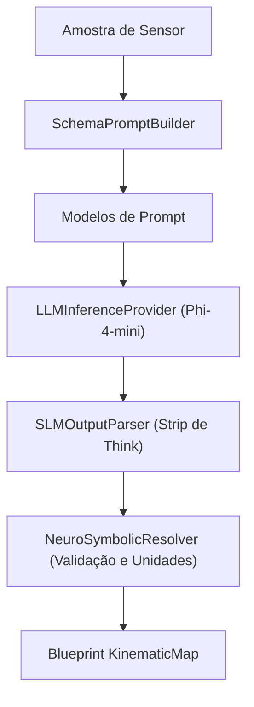

# 🧠 Pipeline Neural e Motor SLM

O **Pipeline Neural do SFusion** implementa uma arquitetura **Neuro-Simbólica** local para automatizar a descoberta de esquemas em dados de mobilidade urbana. É acionado por um Modelo Pequeno de Linguagem (SLM) local — **Phi-4-mini-reasoning** — executado via `llama.cpp` com aceleração por GPU via CUDA.

⬅️ [Central de Documentação](README.md) | 🏛️ [Arquitetura](architecture.md) | 🚀 [Aceleração e CUDA](hardware_and_cuda.md)

---

## 1. Arquitetura Neuro-Simbólica

Métodos convencionais de mapeamento dependem de regex rígidos ou de grandes LLMs em nuvem (caros, lentos e com riscos de privacidade de dados municipais).

O SFusion une as duas abordagens:
1. **Componente Neural**: O SLM local processa amostras de dados e interpreta a semântica humana dos campos (ex: detecta que `v_kmh`, `velocidade` e `currentSpeed` se referem à mesma grandeza física).
2. **Componente Simbólico**: Um validador determinístico (`NeuroSymbolicResolver`) verifica as colunas sugeridas contra regras físicas, confere unidades de medida e compila o blueprint `KinematicMap`.

---

## 2. Componentes do Subsistema de IA

1. **`SLMEngine` (`src/agent/slm_engine.py`)**: Fachada principal coordenando montagem de prompts, inferência em hardware, parsing e resolução simbólica.
2. **`LLMInferenceProvider` (`src/slm/llm_provider.py`)**: Encapsula `llama_cpp.Llama`, descarga para VRAM (`n_gpu_layers = -1`), FlashAttention e decodificação determinística (`temperature = 0.0`).
3. **`SchemaPromptBuilder` (`src/slm/prompt_builder.py`)**: Percorre chaves aninhadas de arquivos JSON e CSV, gerando representações hierárquicas pontuadas (ex: `features.properties.speed`).
4. **`SLMOutputParser` (`src/slm/slm_output_parser.py`)**: Remove blocos de raciocínio `<think>...</think>` gerados por modelos de reasoning e isola o JSON estruturado.
5. **`NeuroSymbolicResolver` (`src/slm/neuro_symbolic_resolver.py`)**: Cruza colunas candidatas com dicionários heurísticos (`SPEED_CANDIDATES`, `FLOW_CANDIDATES`, `INTENSITY_CANDIDATES`), deduz unidades e calcula o score de confiança.

---

## 🔗 Documentos Relacionados
* [Central de Documentação](README.md)
* [Aceleração e CUDA](hardware_and_cuda.md)
* [Modelos de Dados](data_models.md)
