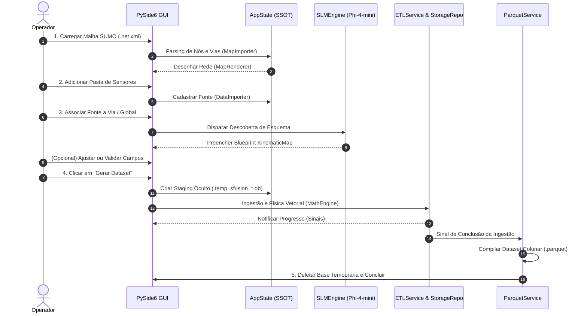

# 🔄 Fluxo de Trabalho do Sistema e Ciclo de Vida dos Dados

O **SFusion Mapper** opera através de um ciclo de vida determinístico de 5 fases, transformando telemetria bruta e não alinhada em um dataset **Apache Parquet** validado para simulações urbanas.

⬅️ [Central de Documentação](README.md) | 🏛️ [Arquitetura](architecture.md) | 🖥️ [Guia do Usuário](user_guide.md)

---

## 1. Diagrama de Sequência Ponta a Ponta

---

## 2. Detalhamento das 5 Fases

### Fase 1: Ingestão da Topologia Viária
* O operador abre uma malha viária padrão (`.net.xml`) ou comprimida (`.net.xml.gz`).
* O `MapImporter` extrai cruzamentos (`MapNode`) e segmentos de vias (`MapEdge`).
* O `AppState` armazena o grafo e o `MapRenderer` desenha a malha vetorial na tela.

### Fase 2: Cadastro de Fontes de Dados
* O operador seleciona pastas com telemetria (CSV, JSON, XML, Excel).
* O `DataImporter` analisa cabeçalhos, identifica formatos e registra o `DataSource` no `AppState`.

### Fase 3: Associação e Descoberta Neuro-Simbólica
* O operador associa o sensor a uma via (Local) ou a toda a cidade (Global).
* O `SLMEngine` consulta o modelo *Phi-4-mini* para deduzir o papel das colunas.
* O `NeuroSymbolicResolver` valida as grandezas físicas e preenche o `KinematicMap`.

### Fase 4: Ingestão em Base de Staging
* O operador aciona "Gerar Dataset".
* Uma base SQLite temporária é criada (`.temp_sfusion_<nome>.db`).
* Trabalhadores multithread arquivam os dados brutos em Bronze, inserem eventos em Prata e aplicam as equações da física vetorial em paralelo via Polars AST.

### Fase 5: Exportação Colunar e Limpeza
* O `ParquetService` consolida as tabelas, unifica coordenadas e timestamps UTC e grava o arquivo `.parquet` com compressão Snappy.
* O `MainController._cleanup_temp_files()` apaga completamente a base temporária e seus arquivos WAL.

---

## 🔗 Documentos Relacionados
* [Central de Documentação](README.md)
* [Pipeline ETL](etl_pipeline.md)
* [Guia do Usuário](user_guide.md)

---

   
  <b>Noxfort Systems</b> — <i>A State Of Art Company</i> 
  <i>Engenharia de Mobilidade Inteligente • SFusion Mapper v0.1.0</i> 
  <small>© 2026 Noxfort Systems. Licenciado sob AGPLv3.</small>

