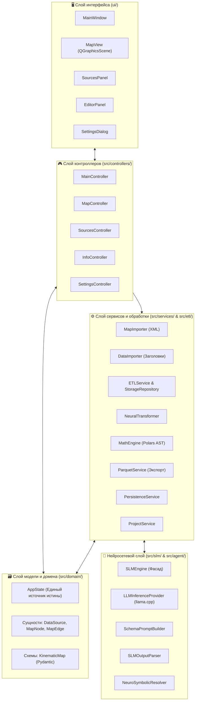

# 🏛️ Архитектура системы и инженерные принципы

В данном документе представлена подробная спецификация программной архитектуры, используемых шаблонов проектирования и разделения ответственности компонентов **SFusion Mapper**.

⬅️ [Главный Хаб](README.md) | 📖 [Базовые концепции](core_concepts.md) | ⚡ [Конвейер ETL](etl_pipeline.md) | 🧪 [Тестирование](testing.md)

---

## 1. Высокоуровневая архитектура системы

Приложение разработано на языке Python 3 с применением фреймворка **PySide6 (Qt6)** в строгом соответствии с концепцией **Чистой архитектуры** (Clean Architecture), принципами **SOLID** и паттерном **Model-View-Controller (MVC)**, собираемым через **Builder Pattern**:

---

## 2. Строитель приложения (`src/core/app_builder.py`)

1. `AppBuilder._build_utils()`: инициализирует менеджеры конфигурации и мультиязычности.
2. `AppBuilder._build_models()`: создает центральный экземпляр `AppState`.
3. `AppBuilder._build_services()`: инициализирует фоновые сервисы, импортеры и генератор Parquet.
4. `AppBuilder._build_views()`: строит графические виджеты Qt.
5. `AppBuilder._build_renderers()`: подключает векторный рендерер (`MapRenderer`) к сцене.
6. `AppBuilder._build_controllers()`: внедряет зависимости в контроллеры.
7. `AppBuilder._setup_connections()`: соединяет сигналы и слоты Qt.

---

## 3. Описание слоев

### 3.1 Слой представления (`ui/`)
* **`MainWindow`**: главное окно приложения с панелями управления и статусной строкой.
* **`MapView`**: интерактивный компонент `QGraphicsView` для работы с графом дорог SUMO.
* **`SourcesPanel`**: боковая панель зарегистрированных источников данных.
* **`EditorPanel`**: инспектор кинематических параметров и назначения реальных названий улиц.
* **`SettingsDialog`**: диалоговое окно настроек языка и цветовых тем.

### 3.2 Слой контроллеров (`src/controllers/`)
* **`MainController`**: координатор жизненного цикла проектов и 5-фазного конвейера.
* **`MapController`**: обработка кликов мыши, выделение полос и парных направлений.
* **`SourcesController`**: переключение между локальным и глобальным связыванием.
* **`InfoController`**: синхронизация выбранных элементов с редактором.
* **`SettingsController`**: сохранение конфигурации приложения.

### 3.3 Доменный слой (`src/domain/`)
* **`AppState`**: реактивный единый источник истины (SSOT).
* **Сущности**: `DataSource`, `MapNode`, `MapEdge` и перечисление `AssociationType`.
* **Схемы**: `KinematicMap` (Pydantic v2).

### 3.4 Слой сервисов и обработки (`src/services/` & `src/etl/`)
* **`ETLService`**: многопоточная обработка данных под управлением `QThreadPool`.
* **`SensorBatchProcessor`**: файловый ввод-вывод, хэширование MD5 и сжатие zlib.
* **`ETLStorageRepository`**: транзакционная запись в SQLite WAL.
* **`MathEngine`**: построение векторных выражений Polars AST (`pl.Expr`) для единиц СИ.
* **`ParquetService`**: консолидация и сохранение в формат Apache Parquet.

---

## 🔗 Полезные ссылки
* [Главный Хаб](README.md)
* [Базовые концепции](core_concepts.md)
* [Модели данных](data_models.md)
