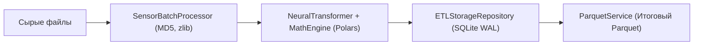

# ⚡ Высокопроизводительный конвейер ETL

**ETL-конвейер SFusion** — это многопоточный компонент пакетной обработки данных, оптимизированный по расходу оперативной памяти и формирующий нормализованные наборы данных Parquet.

⬅️ [Главный Хаб](README.md) | 🏛️ [Архитектура](architecture.md) | 📐 [Физический движок](math_engine.md)

---

## 1. Трехуровневая медальонная модель



1. **Слой Bronze**: исходные файлы сжимаются алгоритмом `zlib` (уровень 6) с контрольными суммами MD5 в таблице `raw_data_storage`.
2. **Слой Silver**: разбор через `orjson`, применение векторных формул `MathEngine` и запись в секционные таблицы `section_<источник>`.
3. **Слой Gold**: объединение данных в монолитный файл Apache Parquet со сжатием Snappy.

---

## 2. Параллелизм и оптимизация SQLite WAL

Настройки Write-Ahead Logging обеспечивают устойчивость при параллельной записи:
```sql
PRAGMA journal_mode = WAL;
PRAGMA busy_timeout = 120000;
PRAGMA synchronous = NORMAL;
PRAGMA cache_size = -64000;  -- 64 МБ кэша в памяти
PRAGMA temp_store = MEMORY;
```
Пакетные транзакции защищены мьютексом `threading.Lock()`, предотвращая блокировку базы при одновременной работе нескольких потоков.

---

## 3. Автоматическая очистка временных файлов

После завершения экспорта контроллер вызывает `MainController._cleanup_temp_files()`, удаляя временную базу `.temp_sfusion_<имя>.db` и сопутствующие файлы WAL (`-wal`, `-shm`).

---

## 🔗 Полезные ссылки
* [Главный Хаб](README.md)
* [Модели данных](data_models.md)
* [Рабочий процесс](system_workflow.md)

---

<div align="center">
  <br/>
  <b>Noxfort Systems</b> — <i>A State Of Art Company</i><br/>
  <i>Инженерия интеллектуальной мобильности • SFusion Mapper v0.1.0</i><br/>
  <small>© 2026 Noxfort Systems. Лицензия AGPLv3.</small>
</div>
