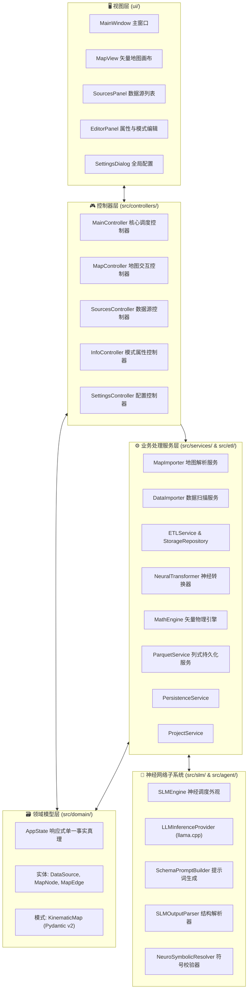

# 🏛️ 系统架构核心规范与工程设计原则

本文档详细阐述 **SFusion Mapper** 的软件系统架构设计、设计模式实践及系统分层边界规范。

⬅️ [文档中心](README.md) | 📖 [核心理念](core_concepts.md) | ⚡ [ETL 流水线](etl_pipeline.md) | 🧪 [测试指南](testing.md)

---

## 1. 高层系统架构设计

本系统采用 Python 3 与 **PySide6 (Qt6)** 构建，严格遵循**整洁架构 (Clean Architecture)** 与 **SOLID 原则**，以 **Builder 模式**实现经典的 **Model-View-Controller (MVC)** 体系：

---

## 2. 应用程序装配器 (`src/core/app_builder.py`)

为杜绝组件间的高耦合与循环导入，系统通过 **Builder 模式**执行依赖注入组装：

1. `AppBuilder._build_utils()`: 初始化多语言国际化模块及系统配置。
2. `AppBuilder._build_models()`: 构建全局单一事实真理 `AppState`。
3. `AppBuilder._build_services()`: 实例化各后台工作服务、数据导入器及 Parquet 导出器。
4. `AppBuilder._build_views()`: 构建被动图形组件与界面。
5. `AppBuilder._build_renderers()`: 绑定高性能矢量绘制引擎 (`MapRenderer`)。
6. `AppBuilder._build_controllers()`: 注入视图与业务模型，建立控制器链路。
7. `AppBuilder._setup_connections()`: 绑定跨越架构边界的 Qt 信号与槽。

---

## 3. 分层架构规范

### 3.1 视图层 (`ui/`)
* **`MainWindow`**: 主窗口容器，托管工具栏、停靠抽屉及系统状态栏。
* **`MapView`**: 定制 `QGraphicsView`，支持高帧率视口平移、滚轮缩放及路网元素点选。
* **`SourcesPanel`**: 侧边面板，管理已注册的传感器文件目录及关联模式状态。
* **`EditorPanel`**: 属性检视器，显示 AI 推荐映射并允许人工覆写校准。
* **`SettingsDialog`**: 模态配置窗口，支持多国语言切换及渲染视觉参数设置。

### 3.2 控制器层 (`src/controllers/`)
* **`MainController`**: 统领工程项目存盘读取、路网载入及五阶段流水线生命周期。
* **`MapController`**: 监听画布事件、处理双向车道对自动高亮联动。
* **`SourcesController`**: 控制数据源激活状态并切换局部与全局生效范围。
* **`InfoController`**: 将选中的路网实体与右侧编辑器进行双向同步。
* **`SettingsController`**: 负责应用首选项持久化落盘。

### 3.3 领域与模型层 (`src/domain/`)
* **`AppState`**: 响应式全局事实真理，继承自 `QObject`，负责发布状态变更信号。
* **领域实体**: `DataSource`、`MapNode`、`MapEdge` 以及 `AssociationType`。
* **契约定义**: 基于 Pydantic v2 构建的强类型 `KinematicMap`。

### 3.4 服务与计算层 (`src/services/` & `src/etl/`)
* **`ETLService` & `ETLWorker`**: 基于 `QThreadPool` 与线程池执行的并行数据摄取器。
* **`SensorBatchProcessor`**: 高效文件 I/O、MD5 完整性哈希与 zlib 字节压缩。
* **`ETLStorageRepository`**: 开启 WAL 模式的高性能多线程 SQLite DAO 存储仓库。
* **`MathEngine`**: 将蓝图编译为原生 Polars AST 矢量计算图（`pl.Expr`），执行国际物理单位规范化。
* **`ParquetService`**: 负责最终 Snappy 压缩的金标 Parquet 文件合并导出。

---

## 🔗 相关技术文档
* [文档中心首页](README.md)
* [核心理论概念](core_concepts.md)
* [数据模型规范](data_models.md)
* [ETL 流水线详解](etl_pipeline.md)

---

   
  <b>Noxfort Systems</b> — <i>卓越科技 • A State Of Art Company</i> 
  <i>智慧交通出行工程 • SFusion Mapper v0.1.0</i> 
  <small>© 2026 Noxfort Systems. 基于 AGPLv3 协议授权.</small>

